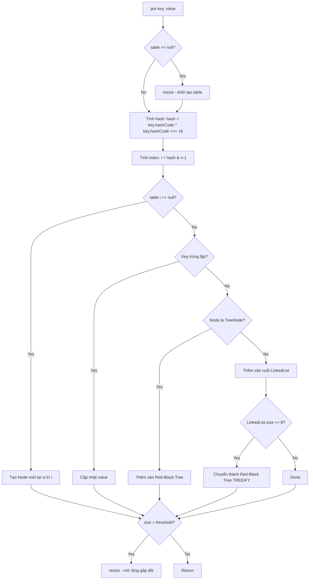
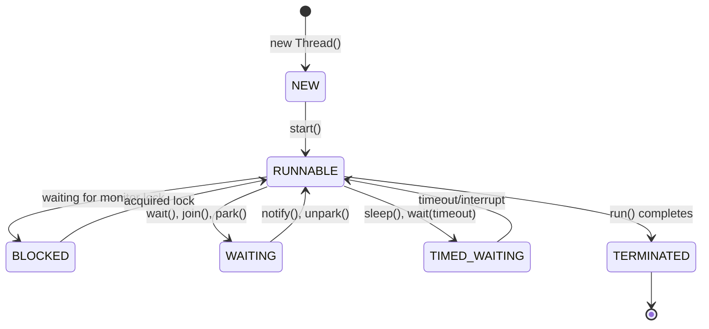
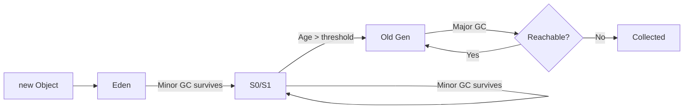
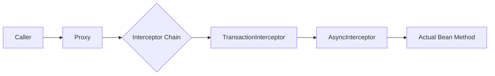
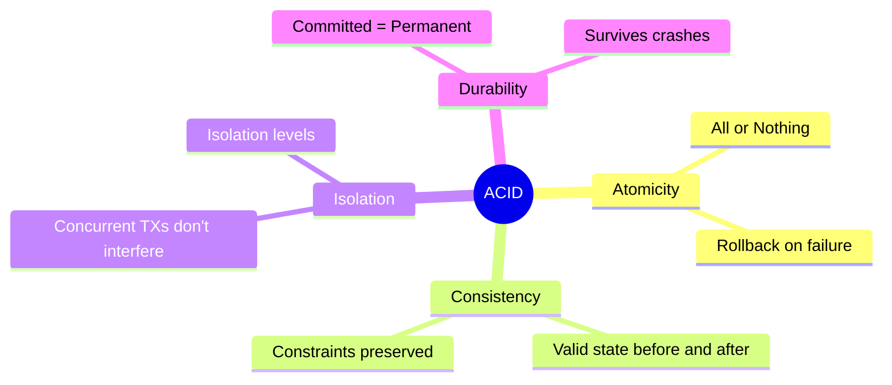
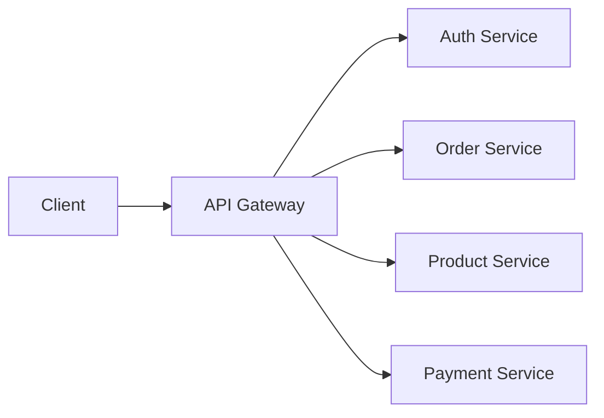
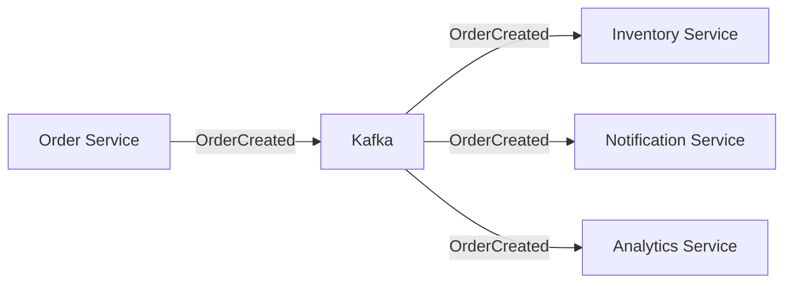
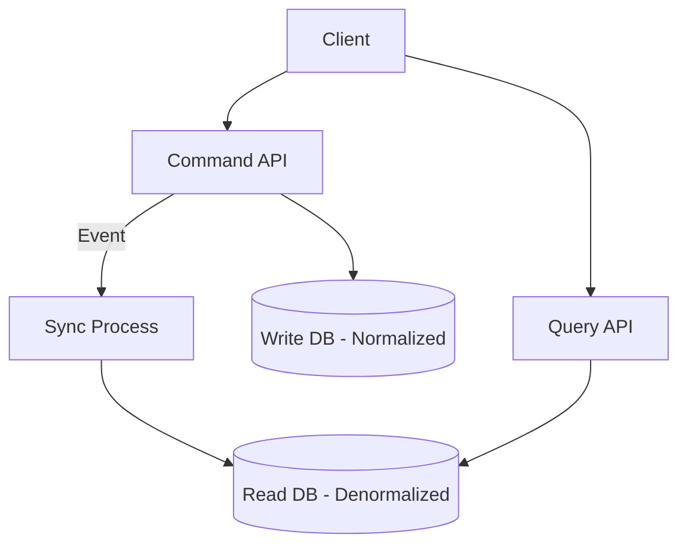

# 🎯 Java Interview Deep Dive - Complete Guide

> **Mục tiêu**: Tài liệu toàn diện cho phỏng vấn Java Backend từ Junior đến Senior

---

## 📚 Table of Contents

1. [[#Java Core]]
2. [[#Spring Framework]]
3. [[#Database]]
4. [[#Design Patterns]]
5. [[#System Design for Microservices]]

---

# Java Core

## 1. HashMap - Behind the Scenes 🔍

### Cấu trúc nội bộ của HashMap

```
HashMap<K, V>
├── Node<K,V>[] table      // Array of buckets (mặc định 16)
├── size                    // Số lượng entries
├── loadFactor             // 0.75 (mặc định)
├── threshold              // capacity × loadFactor
└── modCount               // Đếm số lần thay đổi cấu trúc
```

### Quá trình PUT hoạt động như thế nào?



### Hash Collision - Xử lý va chạm

**Collision xảy ra khi:** 2 keys khác nhau có cùng `hash % capacity`

**Cách giải quyết:**
1. **Separate Chaining** (Java sử dụng):
   - Trước Java 8: LinkedList thuần túy → O(n) trong worst case
   - Từ Java 8: LinkedList + Red-Black Tree → O(log n) khi bucket lớn

2. **Treeification Threshold:**
   - `TREEIFY_THRESHOLD = 8`: Chuyển LinkedList → Tree
   - `UNTREEIFY_THRESHOLD = 6`: Chuyển Tree → LinkedList
   - `MIN_TREEIFY_CAPACITY = 64`: Capacity tối thiểu để treeify

> [!IMPORTANT]
> **Tại sao threshold là 8?**
> Theo phân phối Poisson, xác suất có 8 nodes trong một bucket là ~0.00000006. Nếu xảy ra, có thể là do hash function tệ hoặc attack.

### Resize hoạt động như thế nào?

```java
// Khi size > threshold (capacity × loadFactor)
newCapacity = oldCapacity << 1;  // Nhân đôi
newThreshold = newCapacity × loadFactor;

// Rehash toàn bộ entries
// Node ở bucket i sẽ đi đến:
// - Bucket i (nếu bit mới = 0)
// - Bucket i + oldCapacity (nếu bit mới = 1)
```

---

## 2. HashSet vs HashMap vs TreeSet 🌳

| Feature | HashSet | HashMap | TreeSet |
|---------|---------|---------|---------|
| **Underlying** | HashMap | Node[] + LinkedList/Tree | TreeMap (Red-Black Tree) |
| **Ordering** | ❌ Không đảm bảo | ❌ Không đảm bảo | ✅ Sorted |
| **null** | 1 null | 1 null key, nhiều null values | ❌ Không cho phép null |
| **Time Complexity** | O(1) avg | O(1) avg | O(log n) |
| **Use case** | Unique elements | Key-Value mapping | Sorted unique elements |

### Bên dưới HashSet hoạt động thế nào?

```java
// HashSet.java - thực chất
public class HashSet<E> {
    private transient HashMap<E, Object> map;
    private static final Object PRESENT = new Object(); // Dummy value
    
    public boolean add(E e) {
        return map.put(e, PRESENT) == null;
    }
}
```

### TreeSet - Red-Black Tree Properties

1. Mỗi node là RED hoặc BLACK
2. Root luôn BLACK
3. Mọi leaf (NIL) đều BLACK
4. Nếu node RED, cả 2 con đều BLACK
5. Mọi đường từ node đến leaf có số BLACK nodes bằng nhau

---

## 3. equals() vs hashCode() ⚖️

### Contract quan trọng

```java
// ĐÂY LÀ CONTRACT BẮT BUỘC:
if (a.equals(b)) {
    assert a.hashCode() == b.hashCode(); // PHẢI TRUE
}

// Nhưng:
if (a.hashCode() == b.hashCode()) {
    // a.equals(b) CÓ THỂ false (collision)
}
```

> [!CAUTION]
> **Vi phạm contract = Bug nghiêm trọng!**
> Object sẽ "biến mất" trong HashMap/HashSet vì không tìm được đúng bucket.

### Cách implement đúng

```java
public class Employee {
    private Long id;
    private String name;
    private String department;
    
    @Override
    public boolean equals(Object o) {
        if (this == o) return true;
        if (o == null || getClass() != o.getClass()) return false;
        Employee employee = (Employee) o;
        return Objects.equals(id, employee.id);  // Chỉ so sánh business key
    }
    
    @Override
    public int hashCode() {
        return Objects.hash(id);  // PHẢI dùng cùng fields với equals()
    }
}
```

---

## 4. Pass by Value vs Pass by Reference 📦

> [!IMPORTANT]
> **Java LUÔN là Pass-by-Value!** Nhưng với objects, value đó là reference (địa chỉ bộ nhớ).

### Minh họa trực quan

```
Primitive:
┌─────────────┐    ┌─────────────┐
│ x = 10      │───→│ copy: 10    │  // Thay đổi copy không ảnh hưởng x
└─────────────┘    └─────────────┘

Object Reference:
┌─────────────┐    ┌─────────────┐
│ ref = 0x100 │───→│ copy = 0x100│  // Cùng trỏ đến object
└─────────────┘    └─────────────┘
        │                 │
        └────────┬────────┘
                 ▼
         ┌──────────────┐
         │ Object @ 0x100│  // Thay đổi object ảnh hưởng cả hai
         └──────────────┘
```

### String vs StringBuilder

| String | StringBuilder |
|--------|---------------|
| **Immutable** - mỗi thay đổi tạo object mới | **Mutable** - thay đổi trực tiếp |
| Thread-safe (inherently) | Không thread-safe |
| String Pool → tiết kiệm memory | Không có pool |
| Concatenation: O(n²) trong loop | Append: O(1) amortized |
| Sử dụng khi: ít thay đổi | Sử dụng khi: nhiều modifications |

```java
// BAD - O(n²) time, O(n²) space
String result = "";
for (int i = 0; i < 10000; i++) {
    result += i;  // Mỗi lần tạo String mới!
}

// GOOD - O(n) time, O(n) space
StringBuilder sb = new StringBuilder();
for (int i = 0; i < 10000; i++) {
    sb.append(i);  // Modify in-place
}
```

---

## 5. Multi-threading Deep Dive 🧵

### Thread States



### synchronized vs Lock

```java
// synchronized - Implicit locking
synchronized (lockObject) {
    // critical section
} // Auto-unlock

// ReentrantLock - Explicit locking với nhiều features hơn
ReentrantLock lock = new ReentrantLock(true); // fair lock
try {
    lock.lock();
    // hoặc: lock.tryLock(timeout, TimeUnit.SECONDS)
    // critical section
} finally {
    lock.unlock(); // PHẢI unlock trong finally!
}
```

### ReentrantLock vs synchronized

| Feature | synchronized | ReentrantLock |
|---------|-------------|---------------|
| Fairness | Không | Có thể cấu hình |
| tryLock() | ❌ | ✅ |
| lockInterruptibly() | ❌ | ✅ |
| Multiple Conditions | ❌ | ✅ |
| Performance | Tương đương (Java 6+) | Tương đương |
| Syntax | Đơn giản | Cần try-finally |

---

## 6. Thread-Safe Collections 🛡️

### ConcurrentHashMap - Segment Locking (Pre-Java 8)

```
ConcurrentHashMap (Java 7)
├── Segment[0] ──→ HashEntry[] ──→ LinkedList
├── Segment[1] ──→ HashEntry[] ──→ LinkedList
├── ...
└── Segment[15] ──→ HashEntry[] ──→ LinkedList

// Mỗi Segment có lock riêng → 16 threads có thể write đồng thời
```

### ConcurrentHashMap - CAS + synchronized (Java 8+)

```java
// Không còn Segment, sử dụng CAS cho empty bucket
// synchronized chỉ lock từng bucket khi có collision

Node<K,V>[] table;

// PUT operation:
if ((f = tabAt(tab, i)) == null) {
    if (casTabAt(tab, i, null, new Node<K,V>(hash, key, value)))
        break;  // CAS success, no lock needed
}
else {
    synchronized (f) {  // Lock chỉ bucket này
        // Add to chain or tree
    }
}
```

### CopyOnWriteArrayList

```java
// Mỗi write operation tạo copy mới của underlying array
public boolean add(E e) {
    synchronized (lock) {
        Object[] es = getArray();
        Object[] newElements = Arrays.copyOf(es, len + 1);
        newElements[len] = e;
        setArray(newElements);  // Atomic swap
        return true;
    }
}

// Read KHÔNG cần lock - snapshot consistency
public E get(int index) {
    return elementAt(getArray(), index);
}
```

> [!TIP]
> **Use case:** Read-heavy, write-rarely scenarios (config, listeners)

### ThreadLocal

```java
// Mỗi thread có bản copy riêng của variable
public class UserContext {
    private static final ThreadLocal<User> currentUser = new ThreadLocal<>();
    
    public static void set(User user) {
        currentUser.set(user);
    }
    
    public static User get() {
        return currentUser.get();
    }
    
    public static void clear() {
        currentUser.remove();  // QUAN TRỌNG: tránh memory leak trong thread pool!
    }
}
```

**Cách ThreadLocal hoạt động:**

```
Thread object
└── ThreadLocalMap
    ├── Entry[ThreadLocal<?> key, Object value]
    ├── Entry[ThreadLocal<?> key, Object value]
    └── ...
```

---

## 7. Default Methods in Interface 📝

```java
public interface PaymentProcessor {
    void process(Payment payment);  // Abstract
    
    // Default implementation - Java 8+
    default void validate(Payment payment) {
        if (payment.getAmount() <= 0) {
            throw new IllegalArgumentException("Invalid amount");
        }
    }
    
    // Static method in interface
    static PaymentProcessor createDefault() {
        return payment -> System.out.println("Processing: " + payment);
    }
}

// Diamond Problem Resolution:
interface A { default void foo() { } }
interface B { default void foo() { } }

class C implements A, B {
    @Override
    public void foo() {
        A.super.foo();  // Phải override và chọn explicitly
    }
}
```

---

## 8. Virtual Threads vs Traditional Threads vs ForkJoinPool ⚡

### So sánh

| Feature | Platform Thread | Virtual Thread | ForkJoinPool |
|---------|----------------|----------------|--------------|
| **Memory** | ~1MB stack | ~1KB stack | Platform threads |
| **Scheduling** | OS | JVM | Work-stealing |
| **Blocking** | Blocks OS thread | Unmounts, reuses carrier | Work-stealing kicks in |
| **Best for** | CPU-bound | I/O-bound | Recursive/divide-conquer |
| **Count limit** | ~thousands | Millions | CPU cores |

### Virtual Threads (Java 21+)

```java
// Tạo virtual threads
Thread vThread = Thread.ofVirtual().start(() -> {
    // blocking I/O - không block platform thread!
    String result = httpClient.send(request);
});

// Với Executors
ExecutorService executor = Executors.newVirtualThreadPerTaskExecutor();
executor.submit(() -> {
    // Mỗi task có virtual thread riêng
    Thread.sleep(1000);  // Không waste platform thread!
});
```

### ForkJoinPool

```java
// Work-stealing algorithm
class FibonacciTask extends RecursiveTask<Long> {
    final long n;
    
    @Override
    protected Long compute() {
        if (n <= 1) return n;
        
        FibonacciTask f1 = new FibonacciTask(n - 1);
        FibonacciTask f2 = new FibonacciTask(n - 2);
        
        f1.fork();  // Push to current thread's deque
        Long result2 = f2.compute();  // Compute directly
        Long result1 = f1.join();  // Wait for result (may steal work)
        
        return result1 + result2;
    }
}
```

---

## 9. Java Garbage Collection 🗑️

### Memory Layout

```
JVM Heap
├── Young Generation (Minor GC - frequent, fast)
│   ├── Eden Space (new objects born here)
│   ├── Survivor 0 (S0)
│   └── Survivor 1 (S1)
│
└── Old Generation / Tenured (Major GC - less frequent, slower)
    └── Objects surviving many Minor GCs

Metaspace (not heap - native memory)
└── Class metadata, method bytecode
```

### Object Lifecycle



### Khi nào object bị GC?

1. **Unreachable** - Không có reference path từ GC Roots
2. **GC Roots bao gồm:**
   - Local variables trong active threads
   - Static fields
   - JNI references
   - Active threads themselves

### GC Algorithms

| GC | Best For | Pause | Throughput |
|----|----------|-------|------------|
| **Serial** | Single-core, small heap | High | Low |
| **Parallel** | Throughput-focused | Medium | High |
| **G1** (default Java 9+) | Balanced, large heap | Predictable | Good |
| **ZGC** | Ultra-low latency (<1ms) | Sub-ms | Good |
| **Shenandoah** | Low latency | Sub-ms | Good |

```bash
# G1GC (default)
-XX:+UseG1GC -XX:MaxGCPauseMillis=200

# ZGC (Java 15+)
-XX:+UseZGC -XX:SoftMaxHeapSize=4g
```

---

## 10. Java Stream - parallel() Trade-offs ⚠️

### Khi NÊN dùng parallel()

✅ Data source dễ split: ArrayList, arrays, ranges
✅ Operations không stateful: map, filter (không reduce với shared state)
✅ Collection size đủ lớn (>10,000 elements)
✅ Operations là CPU-intensive
✅ Không có I/O blocking

### Khi KHÔNG NÊN dùng parallel()

❌ LinkedList (split = O(n))
❌ I/O operations (blocking wastes threads)
❌ Small collections (overhead > benefit)
❌ Operations với side effects
❌ Order matters và dùng findFirst()

### Common ForkJoinPool Problem

```java
// DANGER: Tất cả parallel streams share common ForkJoinPool!
list1.parallelStream().forEach(/* slow I/O */);
list2.parallelStream().forEach(/* blocked! */);

// SOLUTION: Custom ForkJoinPool
ForkJoinPool customPool = new ForkJoinPool(16);
customPool.submit(() ->
    list.parallelStream()
        .map(/* ... */)
        .collect(toList())
).join();
```

---

## 11. ArrayList vs HashMap - 1 Million Elements 📊

### Comparison Table

| Operation | ArrayList | HashMap |
|-----------|-----------|---------|
| **Access by index** | O(1) ✅ | N/A |
| **Search by key** | O(n) ❌ | O(1) ✅ |
| **Search by value** | O(n) | O(n) |
| **Iteration** | O(n) - cache friendly ✅ | O(n) - less cache friendly |
| **Memory** | Lower (chỉ values) | Higher (keys + values + overhead) |
| **Order preserved** | ✅ Insertion order | ❌ (dùng LinkedHashMap) |

### Recommendation

```java
// ARRAYLIST khi:
// - Access by index
// - Order matters
// - Sequential iteration
// - Memory constrained

// HASHMAP khi:
// - Lookup by key
// - Check existence: containsKey()
// - Update/remove by key
// - No duplicate keys

// HYBRID approach cho 1M elements:
// Store in ArrayList, build HashMap index for lookups
List<Employee> employees = loadMillionEmployees();
Map<Long, Integer> idToIndex = IntStream.range(0, employees.size())
    .boxed()
    .collect(Collectors.toMap(
        i -> employees.get(i).getId(),
        i -> i
    ));
```

---

## 12. CompletableFuture Deep Dive 🚀

### Cách hoạt động bên trong

```java
CompletableFuture
├── result: Object (kết quả hoặc exception)
├── stack: Completion (linked list của dependent operations)
└── methods:
    ├── complete(T value)     // Set result, trigger dependents
    ├── completeExceptionally(Throwable ex)
    └── postComplete()        // Notify waiting threads
```

### Stages và Execution

```java
CompletableFuture.supplyAsync(() -> fetchData())     // Stage 1: ForkJoinPool.commonPool()
    .thenApply(data -> process(data))                 // Stage 2: Same thread as previous
    .thenApplyAsync(data -> format(data))             // Stage 3: Back to pool
    .thenAcceptAsync(data -> save(data), myExecutor)  // Stage 4: Custom executor
    .exceptionally(ex -> handleError(ex));            // Error handling

// Non-blocking composition
CompletableFuture<String> cf1 = CompletableFuture.supplyAsync(() -> api1());
CompletableFuture<String> cf2 = CompletableFuture.supplyAsync(() -> api2());
CompletableFuture<String> cf3 = CompletableFuture.supplyAsync(() -> api3());

// All parallel, combine results
CompletableFuture.allOf(cf1, cf2, cf3)
    .thenApply(v -> Stream.of(cf1, cf2, cf3)
        .map(CompletableFuture::join)
        .collect(Collectors.toList()));
```

> [!WARNING]
> **Gotcha:** `thenApply` vs `thenApplyAsync`
> - `thenApply`: Có thể chạy trên calling thread nếu future đã complete
> - `thenApplyAsync`: Luôn submit đến executor

---

# Spring Framework

## 1. Dependency Injection Types 💉

### Constructor Injection (RECOMMENDED)

```java
@Service
public class OrderService {
    private final PaymentService paymentService;
    private final InventoryService inventoryService;
    
    // Constructor injection - fields có thể final
    @Autowired  // Optional trong Spring 4.3+ nếu chỉ có 1 constructor
    public OrderService(PaymentService paymentService, 
                        InventoryService inventoryService) {
        this.paymentService = paymentService;
        this.inventoryService = inventoryService;
    }
}
```

**Ưu điểm:**
- Immutable dependencies (final)
- Dễ test với mock
- Fail-fast: thiếu dependency → lỗi lúc startup
- Rõ ràng dependencies

### Setter Injection

```java
@Service
public class ReportService {
    private EmailService emailService;
    
    @Autowired
    public void setEmailService(EmailService emailService) {
        this.emailService = emailService;
    }
}
```

**Use case:**
- Optional dependencies
- **Circular dependency resolution** (A → B → A)

### Field Injection (NOT RECOMMENDED)

```java
@Service
public class NotificationService {
    @Autowired
    private EmailService emailService;  // Không recommend!
}
```

**Tại sao không recommend:**
- Không thể final
- Khó test (cần reflection)
- Hidden dependencies
- Có thể null nếu không được inject

### @Qualifier khi không đủ

```java
@Service
@Primary  // Mặc định khi có nhiều candidates
public class EmailNotificationService implements NotificationService { }

@Service
@Qualifier("sms")
public class SmsNotificationService implements NotificationService { }

// Sử dụng:
@Autowired
@Qualifier("sms")
private NotificationService smsService;

// Nếu @Qualifier vẫn không resolve được?
// 1. Kiểm tra bean name matches
// 2. Sử dụng @Primary
// 3. Tạo custom qualifier annotation
// 4. Sử dụng @ConditionalOnProperty để chỉ load 1 bean
```

---

## 2. @Async và @Transactional - Behind the Scenes 🎭

### Cách Spring tạo Proxy



### Proxy Types

**JDK Dynamic Proxy** (interface-based):

```java
// Spring tạo proxy class at runtime
public class $Proxy0 implements UserService {
    private InvocationHandler h;
    
    public User findById(Long id) {
        return (User) h.invoke(this, 
            method, // findById
            new Object[]{id});
    }
}
```

**CGLIB Proxy** (class-based):

```java
// Kế thừa actual class
public class UserServiceImpl$$EnhancerBySpringCGLIB extends UserServiceImpl {
    private MethodInterceptor interceptor;
    
    @Override
    public User findById(Long id) {
        return interceptor.intercept(this, method, args, methodProxy);
    }
}
```

### @Transactional Self-Invocation Problem ⚠️

```java
@Service
public class OrderService {
    
    @Transactional
    public void processOrder(Order order) {
        // ... some logic
        updateInventory(order);  // ❌ KHÔNG CÓ TRANSACTION!
    }
    
    @Transactional(propagation = Propagation.REQUIRES_NEW)
    public void updateInventory(Order order) {
        // This won't have its own transaction!
    }
}
```

**Tại sao không work?**

```
Caller → Proxy.processOrder() → this.updateInventory()
                   ↓                      ↓
           [Proxy intercepts]    [Direct call, bypass proxy!]
```

**Solutions:**

```java
// Solution 1: Inject self
@Service
public class OrderService {
    @Autowired
    private OrderService self;  // Proxy được inject
    
    @Transactional
    public void processOrder(Order order) {
        self.updateInventory(order);  // ✅ Đi qua proxy
    }
}

// Solution 2: Separate service
@Service
public class InventoryService {
    @Transactional(propagation = Propagation.REQUIRES_NEW)
    public void updateInventory(Order order) { }
}

// Solution 3: ApplicationContext
@Autowired
private ApplicationContext context;

public void processOrder(Order order) {
    context.getBean(OrderService.class).updateInventory(order);
}
```

---

## 3. Transaction Propagation Levels 📊

```java
@Transactional(propagation = Propagation.REQUIRED)  // Default
```

| Level | Existing TX? | Behavior |
|-------|--------------|----------|
| **REQUIRED** | Yes | Join existing |
| | No | Create new |
| **REQUIRES_NEW** | Yes | Suspend, create new |
| | No | Create new |
| **NESTED** | Yes | Create savepoint |
| | No | Create new |
| **SUPPORTS** | Yes | Join |
| | No | Run without TX |
| **NOT_SUPPORTED** | Yes | Suspend |
| | No | Run without TX |
| **MANDATORY** | Yes | Join |
| | No | Throw exception |
| **NEVER** | Yes | Throw exception |
| | No | Run without TX |

---

## 4. Pessimistic vs Optimistic Locking 🔐

### Pessimistic Locking

```java
public interface ProductRepository extends JpaRepository<Product, Long> {
    
    @Lock(LockModeType.PESSIMISTIC_WRITE)
    @Query("SELECT p FROM Product p WHERE p.id = :id")
    Optional<Product> findByIdWithLock(@Param("id") Long id);
}

// SQL generated:
// SELECT * FROM product WHERE id = ? FOR UPDATE
```

**Use case:** High contention, short transactions

### Optimistic Locking

```java
@Entity
public class Product {
    @Id
    private Long id;
    
    @Version  // Tự động kiểm tra version
    private Long version;
    
    private Integer stock;
}

// Khi update, JPA tự thêm:
// UPDATE product SET stock = ?, version = version + 1 
// WHERE id = ? AND version = ?

// Nếu version không match → OptimisticLockException
```

**Use case:** Low contention, đọc nhiều hơn ghi

### So sánh

| Aspect | Pessimistic | Optimistic |
|--------|-------------|------------|
| Lock timing | Trước khi đọc | Khi commit |
| Concurrency | Thấp | Cao |
| Deadlock risk | Có | Không |
| Performance | Tốt khi high contention | Tốt khi low contention |
| Retry needed | Không | Có |

---

## 5. Isolation Levels 🔒

```java
@Transactional(isolation = Isolation.READ_COMMITTED)
```

| Level | Dirty Read | Non-Repeatable Read | Phantom Read |
|-------|------------|---------------------|--------------|
| READ_UNCOMMITTED | ✅ Possible | ✅ | ✅ |
| READ_COMMITTED | ❌ Prevented | ✅ | ✅ |
| REPEATABLE_READ | ❌ | ❌ | ✅ |
| SERIALIZABLE | ❌ | ❌ | ❌ |

### Giải thích các anomalies

```
Dirty Read: Đọc uncommitted data từ transaction khác
Non-Repeatable Read: Cùng SELECT, result khác nhau trong 1 TX
Phantom Read: Cùng query, số rows khác nhau (INSERT/DELETE từ TX khác)
```

---

## 6. ACID Properties 💰



### Payment Example

```java
@Service
public class PaymentService {
    
    @Transactional  // ACID guaranteed
    public void transfer(Account from, Account to, BigDecimal amount) {
        // Atomicity: Cả 2 phải thành công hoặc cả 2 fail
        from.debit(amount);
        to.credit(amount);
        
        // Consistency: Tổng tiền không đổi
        // Isolation: Không thấy trạng thái trung gian
        // Durability: Sau commit, data được persist
    }
}
```

---

## 7. N+1 Problem và Solutions 🔍

### Problem

```java
@Entity
public class Post {
    @Id
    private Long id;
    
    @OneToMany(mappedBy = "post", fetch = FetchType.LAZY)
    private List<Comment> comments;
}

// N+1 queries:
List<Post> posts = postRepository.findAll();  // 1 query
for (Post post : posts) {
    post.getComments().size();  // N queries!
}
```

### Solutions

**1. JOIN FETCH:**

```java
@Query("SELECT p FROM Post p JOIN FETCH p.comments")
List<Post> findAllWithComments();
// 1 query với JOIN
```

**2. @EntityGraph:**

```java
@EntityGraph(attributePaths = {"comments"})
List<Post> findAll();
```

**3. @BatchSize:**

```java
@OneToMany
@BatchSize(size = 25)  // Load 25 collections per query
private List<Comment> comments;
```

**4. Subselect:**

```java
@OneToMany
@Fetch(FetchMode.SUBSELECT)
private List<Comment> comments;
// SELECT * FROM comments WHERE post_id IN (SELECT id FROM posts)
```

---

## 8. Database + API trong cùng @Transactional ⚠️

### Problem

```java
@Transactional
public void createOrder(Order order) {
    orderRepository.save(order);      // DB operation
    paymentApi.charge(order);         // External API call
    // Nếu API thành công nhưng sau đó có exception?
    // Transaction rollback nhưng payment đã thực hiện!
}
```

### Solutions

**1. Outbox Pattern:**

```java
@Transactional
public void createOrder(Order order) {
    orderRepository.save(order);
    
    // Lưu event vào outbox table (cùng transaction)
    OutboxEvent event = new OutboxEvent(
        "PAYMENT_REQUEST", 
        objectMapper.writeValueAsString(order)
    );
    outboxRepository.save(event);
}

// Separate process đọc outbox và gọi API
@Scheduled(fixedDelay = 1000)
public void processOutbox() {
    List<OutboxEvent> events = outboxRepository.findUnprocessed();
    for (OutboxEvent event : events) {
        try {
            paymentApi.charge(event.getPayload());
            event.markProcessed();
        } catch (Exception e) {
            event.incrementRetry();
        }
        outboxRepository.save(event);
    }
}
```

**2. Saga Pattern:**

```java
// Compensating transactions
public void createOrderSaga(Order order) {
    try {
        orderRepository.save(order);
        PaymentResult result = paymentApi.charge(order);
        order.setPaymentId(result.getId());
        orderRepository.save(order);
    } catch (Exception e) {
        // Compensate: reverse the payment if needed
        if (order.getPaymentId() != null) {
            paymentApi.refund(order.getPaymentId());
        }
        orderRepository.delete(order);
        throw e;
    }
}
```

**3. Two-Phase Commit style:**

```java
@Transactional
public void createOrder(Order order) {
    // Phase 1: Prepare
    order.setStatus(OrderStatus.PENDING);
    orderRepository.save(order);
}

// Async confirmation after API success
@Async
public void confirmOrder(Long orderId) {
    PaymentResult result = paymentApi.charge(orderId);
    
    orderRepository.updateStatus(orderId, 
        result.isSuccess() ? OrderStatus.CONFIRMED : OrderStatus.FAILED);
}
```

---

# Database

## 1. Indexing Mechanism 📇

### B-Tree Index (Default)

```
                    [50]
                   /    \
            [20, 35]    [70, 85]
           /   |   \    /   |   \
        [10] [25] [40] [60] [75] [90]
         ↓    ↓    ↓    ↓    ↓    ↓
       Data  Data Data Data Data Data
```

**Characteristics:**
- Self-balancing
- O(log n) search, insert, delete
- Range queries efficient
- Ordered data

### Composite Index

```sql
CREATE INDEX idx_name_age ON users(name, age);
```

> [!CAUTION]
> **A+B ≠ B+A trong composite index!**

**Leftmost Prefix Rule:**

```sql
-- Index: (A, B, C)

-- ✅ Uses index:
WHERE A = 1
WHERE A = 1 AND B = 2
WHERE A = 1 AND B = 2 AND C = 3

-- ❌ Cannot use index (or partial):
WHERE B = 2                    -- Không có A
WHERE C = 3                    -- Không có A, B
WHERE A = 1 AND C = 3         -- Skip B (có thể partial)
WHERE B = 2 AND C = 3         -- Skip A
```

### Khi nào KHÔNG nên dùng Index

- Low cardinality columns (gender, boolean)
- Frequently updated columns
- Small tables
- Rarely queried columns
- Write-heavy tables

---

## 2. Performance Troubleshooting 🔧

### Step 1: Identify Slow Queries

```sql
-- MySQL slow query log
SET GLOBAL slow_query_log = 'ON';
SET GLOBAL long_query_time = 1;

-- PostgreSQL
SELECT * FROM pg_stat_statements ORDER BY total_time DESC;
```

### Step 2: EXPLAIN ANALYZE

```sql
EXPLAIN ANALYZE SELECT * FROM orders 
WHERE customer_id = 123 AND status = 'PENDING';

-- Look for:
-- - Seq Scan (bad for large tables)
-- - Index Scan (good)
-- - Nested Loop vs Hash Join
-- - Actual rows vs Estimated rows
```

### Step 3: Common Fixes

```sql
-- 1. Add missing index
CREATE INDEX idx_orders_customer_status 
ON orders(customer_id, status);

-- 2. Avoid SELECT *
SELECT id, total, created_at FROM orders;  -- Only needed columns

-- 3. Pagination optimization
-- BAD:
SELECT * FROM orders LIMIT 100000, 20;  -- Scans 100020 rows

-- GOOD (keyset pagination):
SELECT * FROM orders WHERE id > 100000 LIMIT 20;

-- 4. Denormalization for read-heavy
ALTER TABLE orders ADD COLUMN customer_name VARCHAR(100);
```

---

# Design Patterns

## 1. Builder Pattern 🏗️

```java
@Builder
public class Order {
    private Long id;
    private Customer customer;
    private List<OrderItem> items;
    private BigDecimal total;
    private OrderStatus status;
}

// Usage:
Order order = Order.builder()
    .customer(customer)
    .items(items)
    .status(OrderStatus.PENDING)
    .build();
```

**When to use:**
- Object có nhiều fields
- Many optional parameters
- Immutable objects
- Fluent API

---

## 2. Strategy Pattern 🎯

```java
// Strategy interface
public interface PaymentStrategy {
    PaymentResult pay(Order order);
}

// Concrete strategies
@Component
public class CreditCardPayment implements PaymentStrategy {
    public PaymentResult pay(Order order) { /* ... */ }
}

@Component
public class PayPalPayment implements PaymentStrategy {
    public PaymentResult pay(Order order) { /* ... */ }
}

// Context
@Service
public class PaymentService {
    private final Map<PaymentType, PaymentStrategy> strategies;
    
    public PaymentService(List<PaymentStrategy> strategies) {
        this.strategies = strategies.stream()
            .collect(toMap(s -> s.getType(), s -> s));
    }
    
    public PaymentResult processPayment(Order order, PaymentType type) {
        return strategies.get(type).pay(order);
    }
}
```

**When to use:**
- Multiple algorithms/behaviors
- Switch at runtime
- Avoid long if-else/switch
- Open/Closed principle

---

# System Design for Microservices

## 1. API Gateway Pattern 🚪



**Responsibilities:**
- Authentication/Authorization
- Rate limiting
- Request routing
- Load balancing
- Circuit breaking
- Logging/Monitoring

---

## 2. Circuit Breaker Pattern ⚡

```java
@Service
public class PaymentService {
    
    @CircuitBreaker(name = "payment", fallbackMethod = "paymentFallback")
    public PaymentResult charge(Order order) {
        return paymentClient.charge(order);
    }
    
    public PaymentResult paymentFallback(Order order, Exception e) {
        // Queue for later processing
        return PaymentResult.pending();
    }
}
```

**States:**

```
CLOSED → (failures > threshold) → OPEN
                                    ↓
                              (timeout)
                                    ↓
CLOSED ← (success) ← HALF_OPEN → (fail) → OPEN
```

---

## 3. Event-Driven Architecture 📨



**Benefits:**
- Loose coupling
- Scalability
- Eventual consistency
- Audit trail

---

## 4. CQRS Pattern 📊



**When to use:**
- Read/Write có requirements khác nhau
- High read/write ratio
- Complex queries
- Event sourcing

---

## Quick Reference Card 🎴

```
HashMap: O(1) avg, bucket array + linked list/tree, load factor 0.75
HashSet: HashMap wrapper với dummy values
TreeSet: Red-Black Tree, O(log n), sorted

equals/hashCode: Contract - equals true → hashCode must be same

Pass-by-value: Always, but objects pass reference VALUE
String: Immutable, pool | StringBuilder: Mutable, no pool

Thread-safe: ConcurrentHashMap (CAS + bucket lock), CopyOnWriteArrayList
ThreadLocal: Thread-specific storage, remember to remove()!

Virtual Threads: Millions, I/O-bound, ~1KB stack
ForkJoinPool: Work-stealing, divide-conquer

GC: Young (Eden+Survivor) → Old, unreachable = collected
G1GC default Java 9+, ZGC for sub-ms pauses

parallel(): ForkJoinPool.commonPool, good for CPU-bound, large data

@Transactional: Proxy-based, self-invocation bypasses proxy
Propagation: REQUIRED (join), REQUIRES_NEW (suspend, new)
Isolation: READ_COMMITTED default

Pessimistic: FOR UPDATE, high contention
Optimistic: @Version, low contention

N+1: JOIN FETCH, @EntityGraph, @BatchSize

DB + API: Outbox pattern, Saga pattern

Index: B-Tree, leftmost prefix rule, A+B ≠ B+A
```

---

> **Chúc bạn phỏng vấn thành công! 🚀**
