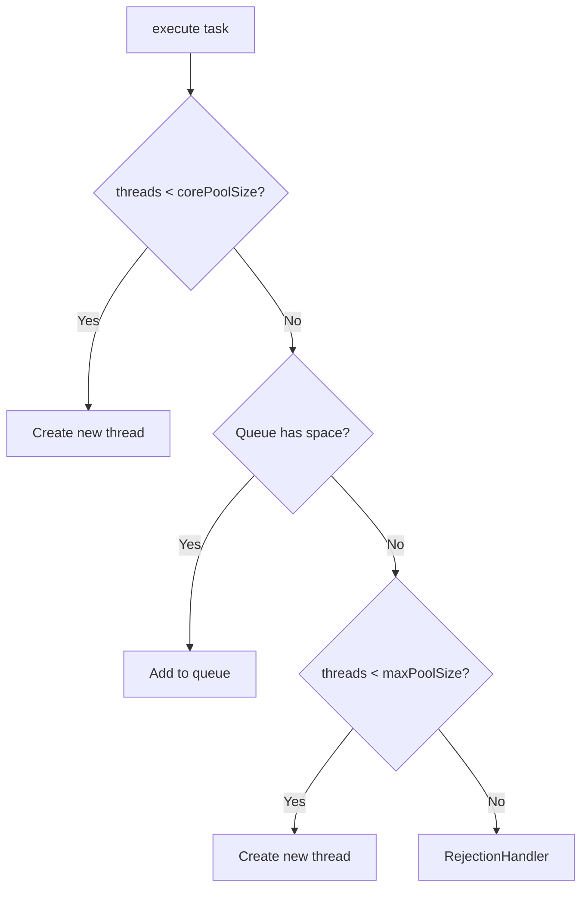

# Concurrency Patterns & Thread Pools - Deep Dive

> **Authors Referenced**: Brian Goetz (Java Concurrency in Practice), Doug Lea

---

## Related Topics

- [[../java-core/jvm-architecture]] - Thread stacks & runtime areas
- [[../java-core/synchronized-internals]] - Monitor locks
- [[../java-core/memory-model]] - Visibility & ordering
- [[volatile-atomics]] - Atomic operations

---

## 1. Thread Pool Fundamentals

### 1.1 ThreadPoolExecutor Anatomy

```java
ThreadPoolExecutor(
    int corePoolSize,         // Minimum threads kept alive
    int maximumPoolSize,      // Maximum threads when queue is full
    long keepAliveTime,       // Idle time before non-core threads die
    TimeUnit unit,
    BlockingQueue<Runnable> workQueue,  // Task queue
    ThreadFactory threadFactory,
    RejectedExecutionHandler handler
)
```

### 1.2 Task Submission Flow



### 1.3 Rejection Policies

| Policy | Behavior |
|--------|----------|
| `AbortPolicy` | Throw `RejectedExecutionException` (default) |
| `CallerRunsPolicy` | Execute in caller's thread (backpressure) |
| `DiscardPolicy` | Silently drop task |
| `DiscardOldestPolicy` | Drop oldest queued task, retry submit |

### 1.4 Queue Types

| Queue | Capacity | Behavior |
|-------|----------|----------|
| `LinkedBlockingQueue` | Unbounded* | Tasks queue indefinitely ⚠️ |
| `ArrayBlockingQueue` | Fixed | Blocks when full |
| `SynchronousQueue` | 0 | Direct handoff |
| `PriorityBlockingQueue` | Unbounded | Priority ordering |

> [!WARNING]
> **Never use** `Executors.newFixedThreadPool()` in production - it uses unbounded queue that can cause OOM!

```java
// ✅ CORRECT: Explicit bounded queue
ThreadPoolExecutor executor = new ThreadPoolExecutor(
    4, 10,
    60L, TimeUnit.SECONDS,
    new LinkedBlockingQueue<>(100),  // Bounded!
    new ThreadPoolExecutor.CallerRunsPolicy()
);
```

---

## 2. Lock Types Comparison

### 2.1 ReentrantLock

```java
ReentrantLock lock = new ReentrantLock(true);  // fair=true

lock.lock();
try {
    // critical section
} finally {
    lock.unlock();
}

// Advanced features
if (lock.tryLock(5, TimeUnit.SECONDS)) {
    try {
        // Got lock within timeout
    } finally {
        lock.unlock();
    }
} else {
    // Handle timeout - avoid deadlock
}
```

### 2.2 ReadWriteLock

```java
ReentrantReadWriteLock rwLock = new ReentrantReadWriteLock();

// Multiple readers can hold read lock simultaneously
public Data read() {
    rwLock.readLock().lock();
    try {
        return data;
    } finally {
        rwLock.readLock().unlock();
    }
}

// Writer needs exclusive access
public void write(Data data) {
    rwLock.writeLock().lock();
    try {
        this.data = data;
    } finally {
        rwLock.writeLock().unlock();
    }
}
```

### 2.3 StampedLock (Java 8+)

```java
StampedLock sl = new StampedLock();

// Optimistic read - no blocking!
long stamp = sl.tryOptimisticRead();
double x = this.x, y = this.y;

if (!sl.validate(stamp)) {
    // Someone wrote - fall back to blocking read
    stamp = sl.readLock();
    try {
        x = this.x;
        y = this.y;
    } finally {
        sl.unlockRead(stamp);
    }
}
return new Point(x, y);
```

| Lock | Overhead | Fairness | Optimistic |
|------|----------|----------|------------|
| `synchronized` | Medium | No | No |
| `ReentrantLock` | Medium | Configurable | No |
| `ReadWriteLock` | Higher | Configurable | No |
| `StampedLock` | Lowest | No | ✅ Yes |

---

## 3. Concurrent Collections

### 3.1 ConcurrentHashMap

```java
ConcurrentHashMap<String, Integer> map = new ConcurrentHashMap<>();

// Atomic operations
map.putIfAbsent("key", 1);
map.computeIfAbsent("key", k -> expensiveComputation(k));
map.merge("key", 1, Integer::sum);  // Atomic increment

// Bulk operations (process in parallel)
map.forEach(1000, (k, v) -> process(k, v));  // Parallelism threshold
long sum = map.reduceValuesToLong(1000, v -> v, 0L, Long::sum);
```

**Internal Structure (Java 8+):**

```
ConcurrentHashMap
├── Node[] table (buckets)
├── CAS for empty bucket insert
└── synchronized (bucket head) for collision handling
```

### 3.2 CopyOnWriteArrayList

```java
CopyOnWriteArrayList<String> list = new CopyOnWriteArrayList<>();

// Writes are expensive (full array copy)
list.add("item");  // O(n) - copy entire array

// Reads are lock-free
String item = list.get(0);  // No lock!

// Safe iteration even during modification
for (String s : list) {  // Uses snapshot
    process(s);
}
```

**Best for**: Listener lists, event handlers (read-heavy, rare writes)

### 3.3 BlockingQueue Implementations

```java
// Bounded buffer - producer/consumer
BlockingQueue<Task> queue = new ArrayBlockingQueue<>(100);

// Producer
queue.put(task);  // Blocks if full

// Consumer
Task task = queue.take();  // Blocks if empty

// With timeout
Task task = queue.poll(5, TimeUnit.SECONDS);
```

| Queue | Bounds | Ordering | Performance |
|-------|--------|----------|-------------|
| `ArrayBlockingQueue` | Fixed | FIFO | Good |
| `LinkedBlockingQueue` | Optional | FIFO | Higher throughput |
| `PriorityBlockingQueue` | Unbounded | Priority | Heap overhead |
| `SynchronousQueue` | 0 | Direct handoff | Best for handoff |
| `DelayQueue` | Unbounded | By delay | For scheduling |

---

## 4. Synchronizers

### 4.1 CountDownLatch

```java
CountDownLatch latch = new CountDownLatch(3);

// Worker threads
for (int i = 0; i < 3; i++) {
    executor.submit(() -> {
        doWork();
        latch.countDown();  // Signal completion
    });
}

latch.await();  // Block until count reaches 0
System.out.println("All workers done");
```

**Use case**: Wait for N operations to complete (one-shot)

### 4.2 CyclicBarrier

```java
CyclicBarrier barrier = new CyclicBarrier(3, () -> {
    System.out.println("All threads reached barrier");
});

// Each thread
doPartialWork();
barrier.await();  // Wait for all to reach
doMoreWork();
barrier.await();  // Reusable!
```

**Use case**: Iterative algorithms where threads must sync at each phase

### 4.3 Semaphore

```java
Semaphore sem = new Semaphore(10);  // 10 permits

sem.acquire();  // Get permit (blocks if none available)
try {
    accessResource();
} finally {
    sem.release();  // Return permit
}

// Non-blocking check
if (sem.tryAcquire()) {
    try {
        // Got permit
    } finally {
        sem.release();
    }
}
```

**Use case**: Rate limiting, connection pools

### 4.4 Phaser (Java 7+)

```java
Phaser phaser = new Phaser(1);  // Register self

for (int i = 0; i < 3; i++) {
    phaser.register();  // Dynamic registration
    executor.submit(() -> {
        while (!terminated) {
            doPhaseWork();
            phaser.arriveAndAwaitAdvance();
        }
        phaser.arriveAndDeregister();
    });
}

phaser.arriveAndDeregister();  // Main thread deregisters
```

**Use case**: Dynamic participant count, multi-phase computation

---

## 5. CompletableFuture Patterns

### 5.1 Basic Composition

```java
CompletableFuture.supplyAsync(() -> fetchUser(id))
    .thenApply(user -> enrichUser(user))
    .thenAccept(user -> saveToCache(user))
    .exceptionally(ex -> {
        log.error("Failed", ex);
        return null;
    });
```

### 5.2 Combining Futures

```java
CompletableFuture<User> userFuture = CompletableFuture.supplyAsync(() -> getUser(id));
CompletableFuture<List<Order>> ordersFuture = CompletableFuture.supplyAsync(() -> getOrders(id));

// Wait for both, combine results
CompletableFuture<UserWithOrders> combined = userFuture
    .thenCombine(ordersFuture, (user, orders) -> new UserWithOrders(user, orders));

// Wait for all
CompletableFuture.allOf(future1, future2, future3)
    .thenRun(() -> {
        // All done
    });

// First to complete
CompletableFuture.anyOf(future1, future2, future3)
    .thenAccept(result -> {
        // First result
    });
```

### 5.3 Timeout Handling (Java 9+)

```java
CompletableFuture.supplyAsync(() -> slowOperation())
    .orTimeout(5, TimeUnit.SECONDS)
    .exceptionally(ex -> {
        if (ex.getCause() instanceof TimeoutException) {
            return fallbackValue;
        }
        throw (RuntimeException) ex;
    });

// Or complete with default on timeout
CompletableFuture.supplyAsync(() -> slowOperation())
    .completeOnTimeout(defaultValue, 5, TimeUnit.SECONDS);
```

---

## 6. Virtual Threads (Java 21+)

### 6.1 Basic Usage

```java
// Create virtual thread
Thread vThread = Thread.ofVirtual().start(() -> {
    // Blocking operations don't waste platform thread
    Thread.sleep(1000);
    httpClient.send(request);
});

// Virtual thread executor
try (ExecutorService executor = Executors.newVirtualThreadPerTaskExecutor()) {
    for (int i = 0; i < 100_000; i++) {
        executor.submit(() -> {
            // Each task gets its own virtual thread
            blockingIOOperation();
        });
    }
}
```

### 6.2 Virtual vs Platform Threads

| Aspect | Platform Thread | Virtual Thread |
|--------|----------------|----------------|
| Memory | ~1MB stack | ~1KB |
| Count | ~thousands | Millions |
| Blocking | Wastes OS thread | Cheap - unmounts |
| Scheduling | OS | JVM |
| Best for | CPU-bound | I/O-bound |

> [!IMPORTANT]
> **Do NOT pool virtual threads!** Create new ones per task - they're cheap.

---

## 7. Common Concurrency Bugs

### 7.1 Deadlock

```java
// ❌ Potential deadlock
void transfer(Account a, Account b, int amount) {
    synchronized (a) {
        synchronized (b) {  // Another thread: synchronized(b) then (a)
            // ...
        }
    }
}

// ✅ Fix: Lock ordering
void transfer(Account a, Account b, int amount) {
    Account first = a.id < b.id ? a : b;
    Account second = a.id < b.id ? b : a;
    synchronized (first) {
        synchronized (second) {
            // ...
        }
    }
}
```

### 7.2 Race Condition

```java
// ❌ Race condition
if (!map.containsKey(key)) {
    map.put(key, computeValue());  // Another thread might insert between check and put
}

// ✅ Fix: Atomic operation
map.computeIfAbsent(key, k -> computeValue());
```

### 7.3 Memory Visibility

```java
// ❌ May never terminate
boolean running = true;
new Thread(() -> {
    while (running) { }  // Compiler may hoist the read
}).start();

Thread.sleep(1000);
running = false;

// ✅ Fix: volatile
volatile boolean running = true;
```

---

## Quick Reference: Choosing the Right Tool

| Need | Tool |
|------|------|
| Simple mutual exclusion | `synchronized` |
| Trylock / timeout | `ReentrantLock` |
| Read-heavy access | `ReadWriteLock` |
| Ultra-fast reads | `StampedLock` (optimistic) |
| Thread-safe map | `ConcurrentHashMap` |
| Read-mostly list | `CopyOnWriteArrayList` |
| Producer-consumer | `BlockingQueue` |
| Wait for N tasks | `CountDownLatch` |
| Sync phases | `CyclicBarrier` / `Phaser` |
| Rate limiting | `Semaphore` |
| Async pipelines | `CompletableFuture` |
| I/O-bound scale | Virtual Threads (Java 21+) |
