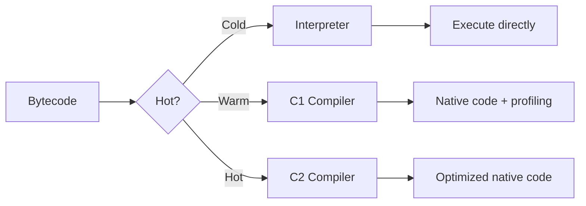

# JVM Architecture - PhD-Level Deep Dive

> **Authors Referenced**: Brian Goetz, Doug Lea, Oracle JVM Specification, OpenJDK HotSpot Source

---

## Related Topics

- [[memory-model]] - Java Memory Model (JMM)
- [[synchronized-internals]] - Monitor locks & object headers
- [[volatile-atomics]] - Memory visibility & barriers
- [[../concurrency/thread-pools]] - Executor framework

---

## 1. JVM High-Level Architecture

```
┌─────────────────────────────────────────────────────────────────────────────┐
│                              Java Virtual Machine                           │
├─────────────────────────────────────────────────────────────────────────────┤
│                                                                             │
│  ┌──────────────────────────────────────────────────────────────────────┐   │
│  │                         Class Loader Subsystem                       │   │
│  │  ┌──────────────┐  ┌──────────────┐  ┌───────────────────────────┐   │   │
│  │  │  Bootstrap   │→ │  Extension   │→ │  Application (System)     │   │   │
│  │  │   Loader     │  │    Loader    │  │       Class Loader        │   │   │
│  │  │ (rt.jar)     │  │ (ext/*.jar)  │  │   (classpath)             │   │   │
│  │  └──────────────┘  └──────────────┘  └───────────────────────────┘   │   │
│  └──────────────────────────────────────────────────────────────────────┘   │
│                                      ↓                                      │
│  ┌─────────────────────────────────────────────────────────────────────┐    │
│  │                        Runtime Data Areas                            │     │
│  │  ┌──────────────┐  ┌──────────┐  ┌───────────────────────────────┐   │     │
│  │  │  Method Area │  │   Heap   │  │  Per-Thread Areas             │   │     │
│  │  │  (Metaspace) │  │          │  │  ┌─────────┐ ┌────┐ ┌──────┐  │   │     │
│  │  │              │  │  Young   │  │  │ Stack   │ │ PC │ │Native│  │   │     │
│  │  │  Class data  │  │  Old     │  │  │ Frames  │ │Reg │ │Stack │  │   │     │
│  │  └──────────────┘  └──────────┘  │  └─────────┘ └────┘ └──────┘  │   │     │
│  │                                   └───────────────────────────────┘   │     │
│  └─────────────────────────────────────────────────────────────────────┘     │
│                                      ↓                                        │
│  ┌─────────────────────────────────────────────────────────────────────┐     │
│  │                         Execution Engine                              │     │
│  │  ┌──────────────┐  ┌──────────────┐  ┌───────────────────────────┐   │     │
│  │  │ Interpreter  │  │  JIT Compiler │  │   Garbage Collector       │   │     │
│  │  │              │  │  (C1, C2)     │  │                           │   │     │
│  │  └──────────────┘  └──────────────┘  └───────────────────────────┘   │     │
│  └─────────────────────────────────────────────────────────────────────┘     │
│                                                                               │
│  ┌─────────────────────────────────────────────────────────────────────┐     │
│  │                        Native Method Interface                        │     │
│  └─────────────────────────────────────────────────────────────────────┘     │
└─────────────────────────────────────────────────────────────────────────────┘
```

---

## 2. Class Loading: Behind the Curtain

### 2.1 The Three Fundamental Loaders

| Loader | Implementation | Loads From | Parent |
|--------|----------------|------------|--------|
| **Bootstrap** | Native (C++) | `$JAVA_HOME/lib` (rt.jar, core libs) | None (primordial) |
| **Extension/Platform** | `sun.misc.Launcher$ExtClassLoader` | `$JAVA_HOME/lib/ext` | Bootstrap |
| **Application/System** | `sun.misc.Launcher$AppClassLoader` | `-classpath` / `CLASSPATH` | Extension |

### 2.2 Delegation Model (Parent-First)

```mermaid
flowchart TD
    A["loadClass(\"com.example.MyClass\")"] --> B{Already loaded?}
    B -->|Yes| C[Return cached Class]
    B -->|No| D[Delegate to parent.loadClass]
    D --> E{Parent can load?}
    E -->|Yes| F[Parent returns Class]
    E -->|No| G[findClass - this loader tries]
    G --> H{Found in this loader's path?}
    H -->|Yes| I[defineClass → Link → Return]
    H -->|No| J[ClassNotFoundException]
```

> [!IMPORTANT]
> **Why Parent-First Delegation?**
> - **Security**: Prevents malicious code from replacing core classes (`java.lang.Object`)
> - **Consistency**: Ensures singleton semantics for core classes
> - **Namespace Isolation**: Same class loaded by different loaders are *different types*

### 2.3 Class Loading Phases

```
  Loading → Linking → Initialization
              │
    ┌─────────┼─────────┐
    ↓         ↓         ↓
Verification Resolution Preparation
```

| Phase | What Happens |
|-------|--------------|
| **Loading** | Binary representation located, bytecodes read |
| **Verification** | Bytecode structural validity, type safety checks |
| **Preparation** | Allocate memory for static fields, set defaults (0/null) |
| **Resolution** | Symbolic references → direct references (may be lazy) |
| **Initialization** | Execute `<clinit>` (static initializers, static blocks) |

### 2.4 Custom Class Loaders

```java
public class HotReloadClassLoader extends ClassLoader {
    private final Path classPath;
    
    public HotReloadClassLoader(Path classPath, ClassLoader parent) {
        super(parent);
        this.classPath = classPath;
    }
    
    @Override
    protected Class<?> findClass(String name) throws ClassNotFoundException {
        try {
            // Convert com.example.Foo → com/example/Foo.class
            String fileName = name.replace('.', '/') + ".class";
            Path classFile = classPath.resolve(fileName);
            byte[] bytecode = Files.readAllBytes(classFile);
            
            // defineClass: bytecode → Class object
            return defineClass(name, bytecode, 0, bytecode.length);
        } catch (IOException e) {
            throw new ClassNotFoundException(name, e);
        }
    }
}
```

> [!TIP]
> **Use Cases for Custom Loaders**:
> - Hot-reloading (JRebel, Spring DevTools)
> - Application isolation (OSGi bundles, Tomcat webapps)
> - Bytecode transformation (instrumentation, AOP)

---

## 3. Runtime Data Areas

### 3.1 Heap (Shared Across Threads)

```
┌─────────────────────────────────────────────────────────────────────┐
│                              JVM Heap                                 │
├─────────────────────────────────────────────────────────────────────┤
│                                                                       │
│  ┌──────────────────────────────────────────┐                        │
│  │            Young Generation               │  (Minor GC area)      │
│  │  ┌───────────────────────────────────┐   │                        │
│  │  │           Eden Space               │   │  Objects born here    │
│  │  │        (80-90% of Young)           │   │                        │
│  │  └───────────────────────────────────┘   │                        │
│  │  ┌─────────────┐  ┌─────────────────┐    │                        │
│  │  │  Survivor 0  │  │   Survivor 1    │    │  "From" / "To" swap   │
│  │  │     (S0)     │  │       (S1)      │    │                        │
│  │  └─────────────┘  └─────────────────┘    │                        │
│  └──────────────────────────────────────────┘                        │
│                                                                       │
│  ┌──────────────────────────────────────────┐                        │
│  │            Old Generation                 │  (Major/Full GC area) │
│  │                                           │                        │
│  │   Long-lived objects (age > threshold)    │  Tenured objects      │
│  │                                           │                        │
│  └──────────────────────────────────────────┘                        │
└─────────────────────────────────────────────────────────────────────┘
```

**Key Parameters:**

```bash
-Xms512m          # Initial heap size
-Xmx4g            # Maximum heap size
-Xmn256m          # Young generation size
-XX:SurvivorRatio=8  # Eden:Survivor ratio (8:1:1)
-XX:MaxTenuringThreshold=15  # Age before promotion
```

### 3.2 Metaspace (Replaced PermGen in Java 8)

```
┌─────────────────────────────────────────┐
│            Metaspace (Native)            │
├─────────────────────────────────────────┤
│  Class metadata (Klass structures)       │
│  Method metadata (bytecode, line tables) │
│  Constant pools                          │
│  Annotations                             │
│  Method counters (for JIT profiling)     │
└─────────────────────────────────────────┘
```

```bash
-XX:MetaspaceSize=128m       # Initial size
-XX:MaxMetaspaceSize=512m    # Maximum size (default: unlimited)
-XX:MinMetaspaceFreeRatio=40 # Expansion threshold
```

> [!WARNING]
> **Metaspace Leaks** occur with:
> - Excessive dynamic class generation (reflection proxies, CGLib)
> - Class loader leaks (webapp redeployment issues)
> - Monitor with: `-XX:+TraceClassLoading -XX:+TraceClassUnloading`

### 3.3 PC Register & Stack (Per-Thread)

| Area | Contents | Size Control |
|------|----------|--------------|
| **PC Register** | Address of current bytecode instruction | Fixed, small |
| **JVM Stack** | Method frames (locals, operand stack, refs) | `-Xss` (default ~512KB-1MB) |
| **Native Stack** | Native method frames (JNI calls) | OS-managed |

```
Stack Frame Structure:
┌────────────────────────┐
│    Local Variables     │  ← slot 0 = this (for instance methods)
├────────────────────────┤
│    Operand Stack       │  ← computation workspace
├────────────────────────┤
│  Dynamic Linking Info  │  ← reference to constant pool
├────────────────────────┤
│  Return Address        │  ← where to continue after return
└────────────────────────┘
```

---

## 4. Execution Engine

### 4.1 Interpreter vs JIT Compilation



### 4.2 Tiered Compilation (Default in Modern JVMs)

| Level | Compiler | Profiling | Speed | Optimization |
|-------|----------|-----------|-------|--------------|
| 0 | Interpreter | Full | Slow | None |
| 1 | C1 | None | Fast | Simple |
| 2 | C1 | Limited | Fast | Simple + counters |
| 3 | C1 | Full | Medium | Simple + full profiling |
| 4 | C2 | Uses L3 data | Slow to compile | Aggressive |

**JIT Optimization Techniques:**

| Optimization | Description |
|--------------|-------------|
| **Inlining** | Replace method call with method body |
| **Escape Analysis** | Stack allocation for non-escaping objects |
| **Loop Unrolling** | Reduce loop overhead |
| **Dead Code Elimination** | Remove unreachable code |
| **Constant Folding** | Evaluate constants at compile time |
| **Lock Elision** | Remove unnecessary synchronization |

```bash
# JIT Tuning
-XX:CompileThreshold=10000     # Hot method threshold
-XX:+TieredCompilation         # Enable tiered (default)
-XX:TieredStopAtLevel=4        # Max compilation level
-XX:+PrintCompilation          # Log compilations
```

---

## 5. Garbage Collection Algorithms

### 5.1 GC Roots & Reachability

```
GC Roots (starting points for live object tracing):
├── Active thread stacks (local variables, parameters)
├── Static fields of loaded classes
├── JNI references
├── Monitor locks (synchronized objects)
└── JVM internal references
```

### 5.2 GC Algorithm Comparison

| GC | Type | Best For | Pause | Throughput | Java Ver |
|----|------|----------|-------|------------|----------|
| **Serial** | Stop-world, single thread | Small heaps, single CPU | High | Low | All |
| **Parallel** | Stop-world, multi-thread | Throughput-focused | Medium | High | All |
| **CMS** | Concurrent mark-sweep | Low latency (deprecated) | Low | Medium | ≤14 |
| **G1** | Region-based, incremental | Balanced, large heaps | Predictable | Good | 9+ default |
| **ZGC** | Concurrent, colored pointers | Ultra-low latency (<1ms) | Sub-ms | Good | 15+ |
| **Shenandoah** | Concurrent compaction | Low latency | Sub-ms | Good | 12+ |

### 5.3 G1 GC Deep Dive

```
G1 Heap Layout:
┌────┬────┬────┬────┬────┬────┬────┬────┬────┬────┐
│ E  │ E  │ E  │ S  │ O  │ O  │ H  │ E  │ O  │ S  │
└────┴────┴────┴────┴────┴────┴────┴────┴────┴────┘
  ↑                           ↑
  Eden regions              Humongous region (large objects)

E = Eden, S = Survivor, O = Old, H = Humongous
```

**G1 Collection Phases:**

1. **Young Collection**: Evacuate Eden + Survivors → New survivors / Old
2. **Concurrent Marking**: Build live object map while app runs
3. **Mixed Collection**: Collect Young + Selected Old regions

```bash
# G1 Tuning
-XX:+UseG1GC
-XX:MaxGCPauseMillis=200       # Target pause time
-XX:G1HeapRegionSize=4m        # Region size (1-32MB)
-XX:InitiatingHeapOccupancyPercent=45  # Start concurrent marking
```

### 5.4 ZGC: Sub-Millisecond Pauses

```
ZGC Key Innovations:
├── Colored Pointers (metadata in pointer bits)
├── Load Barriers (handle concurrent relocation)
├── No generational (single generation)
└── Concurrent phases (mark, relocate, remap)
```

```bash
-XX:+UseZGC
-XX:+ZGenerational           # Generational ZGC (Java 21+)
-XX:SoftMaxHeapSize=4g       # Target heap size
-Xmx16g                      # Maximum heap
```

---

## 6. Object Memory Layout

### 6.1 Object Header Structure (HotSpot)

```
64-bit JVM Object Layout:
┌─────────────────────────────────────────────┐
│                  Object Header               │ (12-16 bytes)
├─────────────────────────────────────────────┤
│  Mark Word (8 bytes)                         │
│  ┌─────────────────────────────────────────┐│
│  │ [hashcode:31][age:4][biased:1][lock:2]  ││ → Normal state
│  │ [thread:54][epoch:2][age:4][biased:1][01]│ → Biased lock
│  │ [ptr to lock record:62            ][00] ││ → Lightweight lock
│  │ [ptr to monitor:62                ][10] ││ → Heavyweight lock
│  │ [forwarding ptr               ][11]     ││ → GC marked
│  └─────────────────────────────────────────┘│
│  Klass Pointer (4 bytes compressed / 8)      │
│  [Array Length] (4 bytes, only for arrays)   │
├─────────────────────────────────────────────┤
│                  Instance Data               │
├─────────────────────────────────────────────┤
│                   Padding                    │ (8-byte alignment)
└─────────────────────────────────────────────┘
```

> [!NOTE]
> See [[synchronized-internals]] for detailed explanation of lock states in Mark Word.

### 6.2 Compressed OOPs

```bash
-XX:+UseCompressedOops        # Default for heaps < 32GB
-XX:+UseCompressedClassPointers
```

| Setting | Klass Pointer | Reference | Max Heap |
|---------|---------------|-----------|----------|
| Compressed | 4 bytes | 4 bytes | ~32GB |
| Uncompressed | 8 bytes | 8 bytes | >32GB |

---

## 7. JVM Tuning Checklist

### 7.1 Essential Flags

```bash
# Memory
-Xms4g -Xmx4g                    # Set min=max to avoid resizing
-XX:MetaspaceSize=256m

# GC Selection
-XX:+UseG1GC                     # Balanced (default 9+)
-XX:+UseZGC                      # Low latency (15+)
-XX:+UseShenandoahGC             # Low latency alt

# Diagnostics
-XX:+HeapDumpOnOutOfMemoryError
-XX:HeapDumpPath=/var/log/heap.hprof
-Xlog:gc*:file=/var/log/gc.log

# Performance
-XX:+AlwaysPreTouch              # Pre-touch heap pages
-XX:+UseStringDeduplication      # G1 string dedup
```

### 7.2 Monitoring & Profiling

| Tool | Purpose |
|------|---------|
| `jstat -gc <pid> 1000` | GC statistics every 1s |
| `jmap -dump:format=b,file=heap.hprof <pid>` | Heap dump |
| `jstack <pid>` | Thread dump |
| `async-profiler` | CPU/allocation profiling |
| `JFR (Flight Recorder)` | Production profiling |

```bash
# Enable JFR
java -XX:StartFlightRecording=duration=60s,filename=rec.jfr -jar app.jar
```

---

## Quick Reference: Memory Flags

| Flag | Default | Description |
|------|---------|-------------|
| `-Xms` | 1/64 physical | Initial heap |
| `-Xmx` | 1/4 physical | Max heap |
| `-Xss` | 512K-1M | Thread stack size |
| `-XX:MetaspaceSize` | ~21MB | Initial metaspace |
| `-XX:MaxMetaspaceSize` | Unlimited | Max metaspace |
| `-XX:MaxDirectMemorySize` | `-Xmx` | Max direct ByteBuffer |
