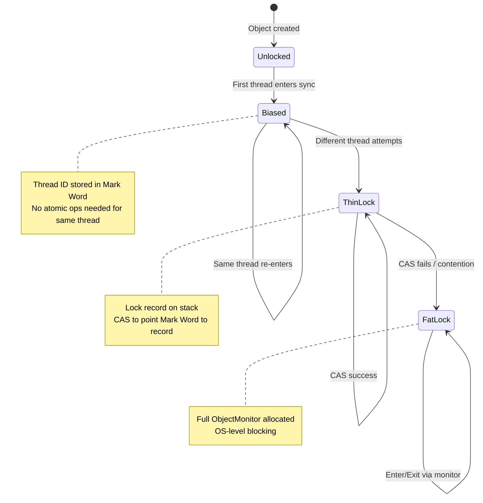
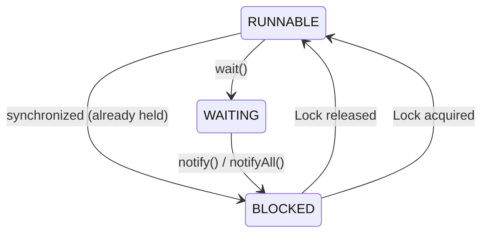

# synchronized Internals - How Monitors Really Work

> **Authors Referenced**: Doug Lea, Oracle HotSpot Source, JSR-133 Cookbook

---

## Related Topics

- [[jvm-architecture]] - Object headers & Mark Word
- [[memory-model]] - Happens-before relationships
- [[volatile-atomics]] - Memory barriers
- [[../concurrency/locks-conditions]] - ReentrantLock comparison

---

## 1. The Object Monitor Model

Every Java object has an **intrinsic lock** (also called a **monitor**). The `synchronized` keyword requests exclusive access to this monitor.

```
Object Monitor Structure (ObjectMonitor in HotSpot):
┌────────────────────────────────────────────────────┐
│                   ObjectMonitor                    │
├────────────────────────────────────────────────────┤
│  _owner         │ Thread currently holding lock    │
│  _recursions    │ Reentry count (reentrant lock)   │
│  _EntryList     │ Threads blocked waiting to enter │
│  _WaitSet       │ Threads in wait() state          │
│  _cxq           │ ContentionQueue (recent arrivals)│
└────────────────────────────────────────────────────┘
```

### 1.1 Reentrancy

**`synchronized` is reentrant**: A thread that holds a lock can re-enter additional `synchronized` blocks on the **same object** without blocking.

```java
public class ReentrantExample {
    
    public synchronized void methodA() {
        System.out.println("In methodA");
        methodB();  // ✅ Same thread can enter - no deadlock!
    }
    
    public synchronized void methodB() {
        System.out.println("In methodB");
        // Same thread already holds 'this' lock
    }
}
```

**How it works**: The JVM tracks a **recursion counter** (`_recursions`) in the ObjectMonitor:

| Action | `_recursions` |
|--------|---------------|
| First `synchronized` entry | 1 |
| Nested entry (same object) | ++ (2, 3, ...) |
| Exit nested block | -- |
| Exit outermost block | 0 → lock released |

> [!NOTE]
> Both `synchronized` and `ReentrantLock` are reentrant. This prevents self-deadlock when a method calls another synchronized method on the same object.

---

## 2. Mark Word & Lock States

The **Mark Word** (first 8 bytes of object header) stores lock state:

```
64-bit Mark Word States:
┌───────────────────────────────────────────────────────────────┐
│  State        │  Mark Word Layout                             │
├───────────────┼───────────────────────────────────────────────┤
│  Unlocked     │ [hash:31][unused:25][age:4][biased:0][lock:01]│
│  Biased       │ [thread:54][epoch:2][age:4][biased:1][lock:01]│
│  Lightweight  │ [ptr to lock record:62             ][lock:00] │
│  Heavyweight  │ [ptr to ObjectMonitor:62           ][lock:10] │
│  GC Mark      │ [forwarding address               ][lock:11]  │
└───────────────────────────────────────────────────────────────┘
```

---

## 3. Lock Inflation Path



---

## 4. Biased Locking (Deprecated in JDK 15+)

**Purpose**: Optimize for uncontended locks where same thread repeatedly acquires lock.

```java
synchronized (lockObject) {
    // If thread matches biased thread in Mark Word:
    // → No atomic CAS needed, just check thread ID
    // 
    // Cost: Simple pointer comparison instead of atomic op
}
```

**How It Works:**

1. First acquisition: CAS thread ID into Mark Word, set biased bit
2. Subsequent acquisitions by same thread: Just compare thread ID (no CAS)
3. Another thread attempts: Revoke bias, inflate to thin lock

```bash
# JVM Flags (pre-JDK 15)
-XX:+UseBiasedLocking           # Enable (default pre-15)
-XX:BiasedLockingStartupDelay=4000  # Delay before biasing starts

# JDK 15+
-XX:-UseBiasedLocking           # Disabled by default
```

> [!WARNING]
> **Deprecation Reason**: Rarely beneficial in modern workloads, adds complexity to GC and code hot-patching (safepoints).

---

## 5. Thin Lock (Lightweight Locking)

**Purpose**: Low-overhead locking when contention is brief or absent.

```
Stack Frame                    Object Header
┌─────────────────┐           ┌─────────────────┐
│  Lock Record    │ ←──────── │  Mark Word      │
│ ┌─────────────┐ │           │  [ptr:62][00]   │
│ │Displaced MW │ │           └─────────────────┘
│ └─────────────┘ │
└─────────────────┘
```

**Algorithm:**

```java
// Pseudo-code for thin lock acquisition
void monitorenter(Object obj) {
    // 1. Create Lock Record on stack
    LockRecord lr = allocateOnStack();
    
    // 2. Copy current Mark Word to Displaced Mark Word
    lr.displacedMarkWord = obj.markWord;
    
    // 3. CAS: try to point Mark Word to Lock Record
    if (CAS(&obj.markWord, lr.displacedMarkWord, lr | LOCK_BITS_00)) {
        // Success! Lock acquired
        return;
    }
    
    // 4. CAS failed - check if reentry (same thread)
    if (isReentry(obj.markWord, currentThread)) {
        lr.displacedMarkWord = 0;  // Mark as nested
        return;
    }
    
    // 5. Contention! Inflate to heavyweight
    inflateToHeavyweight(obj);
}
```

---

## 6. Heavyweight Lock (Fat Lock)

When contention is detected, lock inflates to full **ObjectMonitor**:

```
┌────────────────────────────────────────────────────────────────┐
│                        ObjectMonitor                            │
├────────────────────────────────────────────────────────────────┤
│                                                                  │
│  ┌──────────────────────────────────────────────────────────┐  │
│  │  _owner = Thread A  (holding the lock)                    │  │
│  │  _recursions = 2    (reentry count)                       │  │
│  └──────────────────────────────────────────────────────────┘  │
│                                                                  │
│  ┌──────────────────────────────────────────────────────────┐  │
│  │  _cxq (Contention Queue)                                  │  │
│  │  [Thread D] → [Thread E]    (recently arrived waiters)    │  │
│  └──────────────────────────────────────────────────────────┘  │
│                        ↓                                        │
│  ┌──────────────────────────────────────────────────────────┐  │
│  │  _EntryList                                               │  │
│  │  [Thread B] → [Thread C]    (ready to compete for lock)   │  │
│  └──────────────────────────────────────────────────────────┘  │
│                                                                  │
│  ┌──────────────────────────────────────────────────────────┐  │
│  │  _WaitSet                                                 │  │
│  │  [Thread F] → [Thread G]    (in Object.wait())            │  │
│  └──────────────────────────────────────────────────────────┘  │
│                                                                  │
└────────────────────────────────────────────────────────────────┘
```

**State Transitions with wait/notify:**



---

## 7. wait() / notify() Implementation

```java
synchronized (lock) {
    while (condition == false) {
        lock.wait();  // Release lock, enter WaitSet
    }
    // ... critical section ...
    lock.notifyAll();  // Move all from WaitSet → EntryList
}
```

**Internal Flow:**

```
wait():
1. Release _owner
2. Add current thread to _WaitSet
3. Park thread (OS-level block)

notify():
1. Remove ONE thread from _WaitSet
2. Add to _EntryList (or _cxq)
3. Notified thread must still compete for lock

notifyAll():
1. Move ALL threads from _WaitSet → _EntryList
2. All must compete for lock upon wakeup
```

> [!CAUTION]
> **Spurious Wakeups**: Always use `while` loop for condition check, not `if`. Threads may wake without explicit notify.

---

## 8. synchronized Bytecode

```java
public void syncMethod() {
    synchronized (this) {
        // critical section
    }
}
```

**Compiled Bytecode:**

```
 0: aload_0                 // Push 'this'
 1: dup                     
 2: astore_1               // Store for monitorexit
 3: monitorenter           // ← Acquire lock
 4: // ... critical section ...
 5: aload_1                
 6: monitorexit            // ← Release lock (normal exit)
 7: goto 15
10: astore_2               // Exception handler
11: aload_1
12: monitorexit            // ← Release lock (exception exit)
13: aload_2
14: athrow
15: return
```

> [!NOTE]
> Compiler always generates TWO `monitorexit` instructions: one for normal exit, one for exception exit. This ensures lock is released even if exception occurs.

---

## 9. Memory Semantics

**Happens-Before Guarantees:**

| Operation | Happens-Before Relationship |
|-----------|----------------------------|
| `monitorenter` | Reads see all writes before corresponding `monitorexit` |
| `monitorexit` | All writes flush to main memory |
| Thread start | Thread.start() happens-before first action in started thread |
| Thread join | Last action in thread happens-before join() returns |

**Memory Barriers Inserted:**

```
monitorenter:
  → LoadLoad + LoadStore barriers (acquire semantics)

monitorexit:
  → StoreStore + LoadStore barriers before unlock
  → StoreLoad barrier after unlock (release semantics)
```

See [[memory-model]] for detailed explanation of barriers.

---

## 10. synchronized vs ReentrantLock

| Feature | synchronized | ReentrantLock |
|---------|--------------|---------------|
| **Syntax** | Built-in keyword | Explicit lock/unlock |
| **Reentrant** | ✅ Yes | ✅ Yes |
| **Fairness** | ❌ Not configurable | ✅ `new ReentrantLock(true)` |
| **tryLock** | ❌ No | ✅ `tryLock(timeout)` |
| **Interruptible** | ❌ No | ✅ `lockInterruptibly()` |
| **Multiple Conditions** | ❌ Single wait set | ✅ `newCondition()` |
| **Performance** | Similar (JDK 6+) | Similar |
| **Deadlock recovery** | ❌ No | ✅ tryLock with timeout |

**When to Use ReentrantLock:**

```java
// 1. Need tryLock with timeout
if (lock.tryLock(1, TimeUnit.SECONDS)) {
    try {
        // critical section
    } finally {
        lock.unlock();
    }
} else {
    // Handle timeout - avoid deadlock
}

// 2. Multiple conditions (producer-consumer)
Lock lock = new ReentrantLock();
Condition notEmpty = lock.newCondition();
Condition notFull = lock.newCondition();

// 3. Fair locking
Lock fairLock = new ReentrantLock(true);  // FIFO ordering
```

---

## 11. Common Pitfalls

### 11.1 Lock on Mutable Reference

```java
// ❌ WRONG: Lock object can change!
private Object lock = new Object();

void setLock(Object newLock) {
    lock = newLock;  // Now different threads use different monitors!
}

synchronized (lock) { /* ... */ }

// ✅ CORRECT: Lock on immutable reference
private final Object lock = new Object();
```

### 11.2 Lock on String Literals

```java
// ❌ WRONG: String literals are interned (shared across JVM)
synchronized ("myLock") {  // Same lock object if same literal elsewhere!
    // ...
}

// ✅ CORRECT: Use dedicated lock object
private static final Object LOCK = new Object();
```

### 11.3 Double-Checked Locking (Pre-Java 5)

```java
// ❌ BROKEN without volatile (pre-Java 5)
private static Singleton instance;

public static Singleton getInstance() {
    if (instance == null) {
        synchronized (Singleton.class) {
            if (instance == null) {
                instance = new Singleton();  // May publish partially constructed!
            }
        }
    }
    return instance;
}

// ✅ CORRECT: Add volatile
private static volatile Singleton instance;
```

---

## 12. JVM Flags for Lock Diagnostics

```bash
# Print lock statistics
-XX:+PrintSynchronizedLockContentionInfo

# Disable biased locking (JDK 15+ default)
-XX:-UseBiasedLocking

# Spin lock tuning (before inflating to heavyweight)
-XX:PreInflateSpin=10    # Spin iterations before inflation
```

---

## Quick Reference: Lock Overhead

| Lock State | Acquisition Cost | When Used |
|------------|------------------|-----------|
| Biased | ~1 ns (pointer compare) | Uncontended, same thread |
| Thin | ~10-50 ns (CAS) | Uncontended, different threads |
| Fat | ~10 μs (OS block) | Contended |
