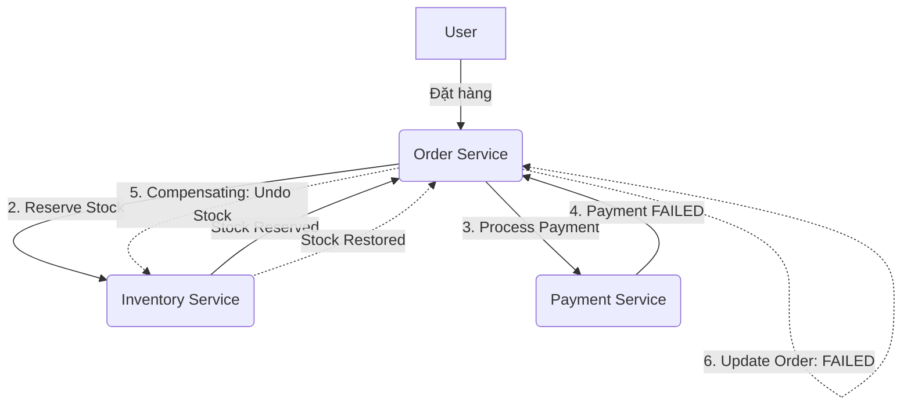

# 🏗️ Microservices Design Patterns: Deep Dive (Vietnamese Edition)

Tài liệu này phân tích sâu về các Design Patterns cốt lõi trong kiến trúc Microservices, tập trung vào cơ chế hoạt động, bài toán thực tế và các đánh đổi (trade-offs) về mặt kỹ thuật.

---

## 1. Saga Pattern (Quản lý Giao dịch Phân tán)

Trong Microservices, mỗi service có database riêng, vì vậy không thể dùng giao dịch ACID thông thường. Saga giải quyết vấn đề này bằng cách chia một giao dịch lớn thành một chuỗi các giao dịch nhỏ cục bộ.

### 1.1. Các hình thức triển khai
| Đặc điểm | Choreography (Dựa trên Sự kiện) | Orchestration (Dựa trên Điều phối) |
| :--- | :--- | :--- |
| **Cơ chế** | Các service tự trao đổi thông qua Event. | Có một "Orchestrator" trung tâm điều phối. |
| **Ưu điểm** | Decoupled hoàn toàn, dễ mở rộng, không có điểm nghẽn trung tâm. | Dễ quản lý luồng phức tạp, dễ trace lỗi, tập trung logic. |
| **Nhược điểm** | Khó visualize luồng, dễ rơi vào vòng lặp event (cyclic dependency). | Orchestrator có thể trở thành Single Point of Failure (SPOF). |

### 1.2. Compensating Transaction (Giao dịch bù)
Nếu một bước trong chuỗi Saga thất bại, hệ thống phải thực hiện các bước "hoàn tác" (Undo) để đảm bảo tính nhất quán (Eventual Consistency).
- **Ví dụ**: Nếu bước "Thanh toán" lỗi, Saga sẽ gọi service "Kho" để hoàn trả lại số lượng sản phẩm đã giữ.

---

## 2. Two-Phase Commit (2PC)

2PC là một giao dịch phân tán kiểu "Blocking" để đảm bảo tính nhất quán mạnh (Strong Consistency).

### 2.1. Cơ chế hoạt động
1. **Phase 1 (Prepare)**: Coordinator hỏi tất cả các node tham gia "Bạn có sẵn sàng commit không?". Các node khóa tài nguyên lại và trả lời "Yes".
2. **Phase 2 (Commit/Rollback)**: Nếu tất cả trả lời "Yes", Coordinator ra lệnh "Commit". Nếu có ít nhất 1 node "No" hoặc timeout, Coordinator ra lệnh "Abort".

### 2.2. Insight & Trade-off
- **Tại sao ít dùng trong Microservices hiện đại?**
    - **Performance**: Nó khóa tài nguyên (Locking) trên nhiều service cho đến khi xong, gây nghẽn cổ chai cực lớn.
    - **Availability**: Nếu Coordinator chết giữa chừng, các node con sẽ bị treo trong trạng thái chờ.
- **Khi nào dùng?** Chỉ dùng trong các hệ thống đòi hỏi tính nhất quán tuyệt đối như Banking nội bộ hoặc các DB Engine hỗ trợ sẵn XA Transactions.

---

## 3. CQRS (Command Query Responsibility Segregation)

CQRS tách biệt hoàn toàn luồng ghi (Command) và luồng đọc (Query).

### 3.1. Tại sao phải tách biệt?
- **Optimization**: DB dùng để ghi (thường là RDBMS) cần chuẩn hóa (Normalization). DB dùng để đọc (như Elasticsearch) cần phẳng (Denormalization) để search nhanh.
- **Scalability**: Luồng đọc thường nhiều gấp 10-100 lần luồng ghi. Tách ra giúp scale riêng lẻ từng phần.

### 3.2. Trade-off
- **Complexity**: Phải quản lý việc đồng bộ dữ liệu giữa Write DB và Read DB (thông qua Event).
- **Eventual Consistency**: Người dùng vừa lưu xong có thể chưa thấy dữ liệu mới ngay lập tức (độ trễ vài mili giây).

---

## 4. Event Sourcing

Thay vì lưu trạng thái hiện tại (Current State), chúng ta lưu toàn bộ lịch sử các sự kiện (Events) đã xảy ra.

### 4.1. Cơ chế
- Trạng thái hiện tại được tính toán bằng cách "Replay" toàn bộ các event từ đầu.
- **Snapshots**: Để tối ưu, thỉnh thoảng hệ thống lưu một bản snapshot tại một thời điểm để không phải replay hàng triệu event.

### 4.2. Insight
- **Audit Log tuyệt đối**: Bạn không bao giờ mất dữ liệu, có thể quay ngược thời gian để debug.
- **Phức tạp**: Cần một Event Store chuyên dụng và tư duy lập trình khác hoàn toàn.

---

## 5. Transactional Outbox Pattern

Đảm bảo rằng việc lưu vào DB và gửi message vào Queue (như Kafka) diễn ra nguyên tử (Atomic).

### 5.1. Vấn đề: "Dual Write Problem"
Nếu bạn lưu DB xong rồi mới gửi Message, nhưng Message Broker sập -> DB đã lưu nhưng các service khác không biết. Ngược lại cũng vậy.

### 5.2. Giải pháp
1. Lưu Message vào một bảng `Outbox` ngay trong cùng giao dịch DB của Business Logic.
2. Một "Message Relay" (hoặc Debezium dùng CDC) sẽ quét bảng này và đẩy vào Message Broker.

---

## 6. BFF (Backend for Frontend)

Tạo ra các service Backend riêng biệt cho từng loại Client (Web, Mobile, IoT).

### 6.1. Tại sao dùng?
- **Payload Optimization**: Mobile chỉ cần ít data hơn Web để tiết kiệm băng thông.
- **Security**: BFF cho Web có thể dùng Cookie/Session, trong khi BFF cho Mobile dùng JWT.
- **Autonomy**: Team Frontend có thể tự quản lý API của chính họ mà không cần đợi team Backend chung.

---

## 7. Strangler Fig Pattern (Mô hình Cây tầm gửi)

Chiến lược phổ biến nhất để chuyển đổi từ Monolith (Khối đơn nhân) sang Microservices.

### 7.1. Cách tiếp cận
- Không đập đi xây lại toàn bộ (Big Bang).
- Xây dựng service mới thay thế từng tính năng nhỏ.
- Dùng API Gateway để điều hướng traffic: Tính năng nào đã tách thì gọi sang Service mới, còn lại vẫn gọi sang Monolith.
- Theo thời gian, Monolith sẽ nhỏ dần và biến mất.

---

## 8. Case Study: Giao dịch phân tán trong Thương mại điện tử

Để hiểu rõ cách các service phối hợp khi có lỗi, hãy xem xét quy trình đặt hàng (Order Flow) sử dụng **Saga Orchestration**.

### 8.1. Các Service tham gia
1.  **Order Service (Orchestrator)**: Quản lý trạng thái đơn hàng và điều phối luồng.
2.  **Inventory Service**: Quản lý kho hàng (giữ chỗ/hoàn trả sản phẩm).
3.  **Payment Service**: Xử lý thanh toán với ngân hàng/gateway.

### 8.2. Kịch bản lỗi: Thanh toán thất bại
Dưới đây là sơ đồ mô tả quá trình xử lý khi bước Thanh toán gặp lỗi:

### 8.3. Giải thích chi tiết luồng xử lý lỗi
1.  **Giao dịch cục bộ 1**: `Order Service` tạo đơn hàng ở trạng thái `PENDING` trong DB của nó.
2.  **Giao dịch cục bộ 2**: `Order Service` gửi lệnh tới `Inventory Service`. Kho hàng trừ số lượng sản phẩm (giữ chỗ).
3.  **Giao dịch cục bộ 3 (LỖI)**: `Order Service` gọi `Payment Service`. Giả sử số dư tài khoản không đủ, `Payment Service` trả về kết quả `FAILED`.
4.  **Kích hoạt Saga Compensation**:
    *   Vì bước 3 lỗi, `Order Service` nhận thấy cần phải "hoàn tác" các bước đã thành công trước đó.
    *   Nó gửi một yêu cầu **Compensating Transaction** tới `Inventory Service` để cộng lại số lượng sản phẩm vào kho.
5.  **Kết thúc**: `Order Service` cập nhật trạng thái đơn hàng thành `FAILED` và thông báo cho người dùng.

### 8.4. Tại sao làm vậy mà không dùng 2PC?
*   **Tính sẵn sàng (Availability)**: Nếu `Payment Service` bị chậm, `Inventory Service` vẫn có thể xử lý các đơn hàng khác sau khi đã thực hiện giao dịch cục bộ. Hệ thống không bị "treo" toàn bộ.
*   **Khả năng phục hồi**: Nếu `Order Service` sập ngay sau khi Payment lỗi, khi khởi động lại, nó có thể đọc trạng thái từ DB và tiếp tục gửi lệnh hoàn kho cho `Inventory Service` (đảm bảo tính nhất quán cuối cùng).

### 8.5. Áp dụng các Pattern khác vào Case Study này

Để tối ưu hóa toàn diện hệ thống Thương mại điện tử này, chúng ta không chỉ dùng Saga mà còn kết hợp các pattern khác:

#### A. Transactional Outbox (Đảm bảo độ tin cậy của Event)
*   **Vấn đề**: Sau khi `Order Service` tạo đơn hàng xong, nếu nó gửi message tới Kafka để bảo `Inventory Service` giữ hàng mà Kafka đang sập -> Mất message.
*   **Áp dụng**: 
    1.  `Order Service` lưu đơn hàng VÀ một bản ghi vào bảng `OUTBOX` trong cùng 1 giao dịch DB.
    2.  Một service phụ (Message Relay) quét bảng `OUTBOX` để đẩy lên Kafka.
    3.  **Kết quả**: Đảm bảo 100% `Inventory Service` sẽ nhận được yêu cầu giữ hàng sớm hay muộn.

#### B. CQRS (Tối ưu hóa việc tra cứu đơn hàng)
*   **Vấn đề**: Khách hàng thường xuyên vào xem danh sách đơn hàng (Read), trong khi quy trình đặt hàng (Write) rất phức tạp với nhiều bước.
*   **Áp dụng**:
    *   **Write Side**: `Order Service` xử lý Saga như trên, lưu vào SQL DB (chuẩn hóa).
    *   **Read Side**: Một service tra cứu (Query Service) đồng bộ dữ liệu từ các Event của Saga vào Elasticsearch.
    *   **Kết quả**: Khách hàng search đơn hàng cực nhanh trên Elasticsearch mà không làm ảnh hưởng đến hiệu năng của luồng đặt hàng chính.

#### C. Event Sourcing (Lịch sử giao dịch tuyệt đối)
*   **Vấn đề**: Khi có tranh chấp hoặc lỗi, rất khó biết chính xác thời điểm nào kho được giữ, thời điểm nào thanh toán lỗi.
*   **Áp dụng**: Thay vì chỉ lưu trạng thái `FAILED`, chúng ta lưu chuỗi event:
    1.  `OrderCreatedEvent`
    2.  `StockReservedEvent`
    3.  `PaymentAttemptedEvent`
    4.  `PaymentFailedEvent`
*   **Kết quả**: Có thể tái hiện lại toàn bộ lịch sử đơn hàng để đối soát với ngân hàng hoặc khách hàng.

#### D. BFF - Backend for Frontend (Trải nghiệm Mobile vs Web)
*   **Vấn đề**: Ứng dụng Mobile chỉ cần hiện thông tin rút gọn của đơn hàng, trong khi Web Dashboard cần hiện chi tiết lịch sử Saga.
*   **Áp dụng**:
    *   **Mobile BFF**: Gọi tới Query Service lấy dữ liệu rút gọn.
    *   **Web BFF**: Gọi tới Query Service lấy dữ liệu chi tiết kèm các trace log của Event Sourcing.

#### E. Tại sao không dùng 2PC ở đây?
*   Nếu dùng 2PC, khi `Payment Service` (bên thứ 3 như Stripe/Paypal) gặp sự cố mạng, toàn bộ `Order Service` và `Inventory Service` sẽ bị khóa (locked). Khách hàng khác không thể đặt các mặt hàng khác vì DB bị lock chờ Coordinator. Saga tránh được điều này bằng cách chấp nhận **Eventual Consistency**.

---

## 📊 Tổng kết So sánh Insight

| Pattern | Vấn đề giải quyết | Trade-off chính | Lời khuyên |
| :--- | :--- | :--- | :--- |
| **Saga** | Giao dịch phân tán | Phức tạp, Eventual Consistency | Dùng Orchestration cho luồng nghiệp vụ chính. |
| **CQRS** | Hiệu năng đọc/ghi | Dữ liệu không đồng bộ tức thì | Chỉ dùng khi logic query thực sự phức tạp. |
| **Event Sourcing** | Audit log, Trạng thái | Lưu trữ lớn, khó học | Dùng cho hệ thống Tài chính/Lịch sử. |
| **Outbox** | Mất Message | Thêm 1 bước xử lý trung gian | **Must-have** khi dùng Event-driven. |
| **BFF** | Trải nghiệm người dùng | Trùng lặp code giữa các BFF | Dùng khi có nhiều loại Client khác biệt. |

---

*Tài liệu này được biên soạn bởi Qoder nhằm cung cấp cái nhìn sâu sắc về kiến trúc hệ thống hiện đại.*
