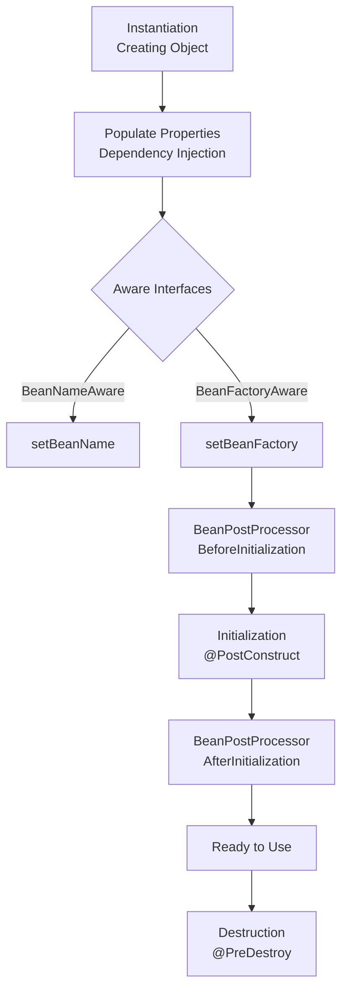

# Spring Framework Expert Guide: Internals & Advanced Patterns

> **Target Audience**: Senior Engineers & Architects
> **Goal**: Deep understanding of Spring internals, performance tuning, and solving complex distributed system challenges.

---

## 1. Spring vs. Spring Boot: The Paradigm Shift

Nhiều người lầm tưởng Spring Boot là một "framework mới". Thực tế, Spring Boot là một **Opinionated View** của Spring Framework.

| Feature | Legacy Spring (MVC) | Spring Boot |
| :--- | :--- | :--- |
| **Config** | **XML Hell** hoặc hàng tá class `@Configuration` thủ công. | **Auto-configuration**: Tự động đoán config dựa trên classpath. |
| **Dependency** | Quản lý version thủ công (dễ conflict jar hell). | **Starters (BOM)**: Curated dependencies, đảm bảo version tương thích. |
| **Runtime** | Phải cài Tomcat/Jetty riêng -> Deploy WAR file. | **Embedded Container**: `java -jar app.jar`. Self-contained. |
| **Monitoring** | Tự build hoặc dùng JMX phức tạp. | **Actuator**: Provide sẵn Health check, Metrics, Env endpoints. |

**Tại sao cả thế giới dùng Spring Boot?**
> **Convention over Configuration**. Thay vì mất 2 tuần để setup Transaction Manager, EntityManagerFactory, ViewResolver... Spring Boot làm việc đó trong 2 giây. Dev chỉ tập trung viết Business Logic.

---

## 2. Staff Engineer Level: Building Your Own Framework

Ở level Staff/Principal, bạn không chỉ dùng Framework, bạn **tạo ra Framework** cho hàng trăm developers khác trong công ty.
Mục tiêu: **"Drop-in and Work"** - Dev chỉ cần thêm dependency, mọi thứ tự chạy.

### 2.1. The "Starter" Pattern (Custom Auto-Configuration)
Bạn muốn mọi microservice trong công ty đều tự động kết nối Kafka và có format log chuẩn? Đừng bắt họ copy-paste config.

**Cấu trúc một Custom Starter**:
1.  **Module**: `acme-logging-spring-boot-starter`
2.  **Dependencies**: Chứa các thư viện cần (Logback, JSON encoder...).
3.  **AutoConfiguration Class**:

```java
@Configuration
@ConditionalOnClass(Logger.class) // Chỉ chạy nếu có class Logger
@ConditionalOnProperty(prefix = "acme.logging", name = "enabled", matchIfMissing = true)
public class AcmeLoggingAutoConfiguration {
    
    @Bean
    @ConditionalOnMissingBean // Chỉ tạo nếu user chưa tự define
    public AcmeLogger acmeLogger(AcmeProperties props) {
        return new AcmeLogger(props.getFormat());
    }
}
```
4.  **Register (The Magic Glue)**:
    *   **Spring Boot 2.7-**: `META-INF/spring.factories`
    *   **Spring Boot 3+**: `META-INF/spring/org.springframework.boot.autoconfigure.AutoConfiguration.imports`

### 2.2. The `@Enable` Module Pattern
Kỹ thuật tạo các annotation "Bật tắt" tính năng. Ví dụ: `@EnableAudit`, `@EnableRetry`.

**Mechanism: `@Import`**:
```java
@Retention(RetentionPolicy.RUNTIME)
@Target(ElementType.TYPE)
@Import(AuditConfigurationSelector.class) // Logic chọn bean để load
public @interface EnableAudit {
    boolean async() default false;
}
```

**Advanced: `ImportBeanDefinitionRegistrar`**:
Khi bạn cần tạo Bean **Động** (Dynamic) mà không biết trước class (Ví dụ: tạo Implementation cho Interface như Spring Data JPA hoặc Feign Client).

```java
public class MyFeignRegistrar implements ImportBeanDefinitionRegistrar {
    @Override
    public void registerBeanDefinitions(AnnotationMetadata metadata, BeanDefinitionRegistry registry) {
        // 1. Scan classpath tìm interfaces
        // 2. Build BeanDefinition (Proxy)
        // 3. Register vào context
    }
}
```

### 2.3. The "Magic Wrapper": BeanPostProcessor
Muốn can thiệp vào Bean **sau khi tạo** nhưng **trước khi dùng**? Đây là nơi Spring dùng để wrap `@Transactional`, `@Async`...

**Use Case**: Bạn muốn mọi Bean có annotation `@SlowCheck` đều được đo thời gian thực thi tự động.

```java
@Component
public class TimingBeanPostProcessor implements BeanPostProcessor {
    @Override
    public Object postProcessAfterInitialization(Object bean, String beanName) {
        if (bean.getClass().isAnnotationPresent(SlowCheck.class)) {
            // Trả về một Proxy wrap bean gốc
            return Proxy.newProxyInstance(..., new TimingInvocationHandler(bean));
        }
        return bean;
    }
}
```

---

### 2.4. The "Ghost" Architecture: Parent-only Magic
Bạn từng thấy project chỉ có 1 file `pom.xml` khai báo `<parent>`, không có code mấy, nhưng khi chạy `Main` class thì cả hệ thống (DB, Web, Security) tự khởi động?

Đây là sự kết hợp của **Maven Inheritance** và **Spring Boot Classpath Scanning**.

#### 1. The Parent POM Power (`spring-boot-starter-parent`)
Khi bạn kế thừa parent này, bạn không chỉ lấy version dependencies. Bạn kế thừa **Build Plugins**.
*   **Magic 1: Dependency Management**: Không cần version cho hàng trăm thư viện (`spring-boot-dependencies` BOM).
*   **Magic 2: Repackage Goal**: `spring-boot-maven-plugin` sẽ can thiệp vào phase `package`. Nó không tạo standard JAR. Nó tạo **Executable JAR** (Fat JAR) chứa tất cả dependencies bên trong.
*   **Magic 3: Manifest Injection**: Plugin tự động thêm `Main-Class: org.springframework.boot.loader.JarLauncher` và `Start-Class: com.example.YourApp` vào `META-INF/MANIFEST.MF`.
    -> Khi bạn chạy `java -jar`, thực tế bạn đang chạy `JarLauncher` của Spring để nó setup classpath ảo, sau đó mới gọi main của bạn.

#### 2. The "Invisible" Code Execution
Code chạy "từ đâu đó" thực chất là cơ chế **SPI (Service Provider Interface)** của Spring Boot.

Khi `SpringApplication.run(Main.class)` được gọi:
1.  Nó scan **TOÀN BỘ** các file `jar` có trong classpath (do Maven Parent tải về).
2.  Nó tìm file `META-INF/spring.factories` (hoặc `AutoConfiguration.imports` trong Boot 3) trong các file jar đó.
3.  Các library (như `spring-boot-starter-web`) đã đăng ký sẵn config trong file này.
    *   Ví dụ: `org.springframework.boot.autoconfigure.web.servlet.DispatcherServletAutoConfiguration`
4.  Spring khởi tạo các Bean này và inject vào context của bạn -> **Code chạy mà bạn không hề viết!**

> **Staff-level Tip**: Để debug xem "Ghost" code nào đang chạy, hãy start app với flag:
> `-Ddebug`
> Console sẽ in ra **CONFIGURATION REPORT** (Positive Matches / Negative Matches), cho biết chính xác AutoConfig nào được kích hoạt và TẠI SAO.

---

### 2.5. Running WITHOUT `@SpringBootApplication` & Module Extension Design

Bạn có thể chạy Spring Boot mà KHÔNG CẦN `@SpringBootApplication`. Annotation đó chỉ là "đường tắt" (Syntactic Sugar) cho `@Configuration` + `@EnableAutoConfiguration` + `@ComponentScan`.

#### 1. The "Raw" Bootstrap Pattern
Để tối ưu hóa startup time hoặc viết các module test cô lập, bạn có thể bootstrap thủ công:

```java
// Main.class - KHÔNG CÓ @SpringBootApplication
public class MyModularApp {
    public static void main(String[] args) {
        new SpringApplicationBuilder()
            .sources(MyCoreConfig.class) // Chỉ load config này
            .bannerMode(Banner.Mode.OFF)
            .run(args);
    }
}

@Configuration
@Import({ WebConfig.class, DataConfig.class }) // Explicitly import modules
public class MyCoreConfig {
    // Manual Bean Definitions
}
```

#### 2. Kỹ thuật thiết kế Module mở rộng (Extensible Design)
Làm sao để viết một Core Framework mà các team khác có thể "cắm" (plug) tính năng vào mà Core không cần sửa code?

**Pattern A: The "List Injection" (Strategy Pattern)**
Core Framework định nghĩa Interface, và gom tất cả implementation từ các module con.

```java
// CORE MODULE
public interface PaymentPlugin {
    boolean supports(String method);
    void process();
}

@Service
public class PaymentEngine {
    private final List<PaymentPlugin> plugins; // Spring tự inject TẤT CẢ beans

    public PaymentEngine(List<PaymentPlugin> plugins) {
        this.plugins = plugins;
    }

    public void pay(String method) {
        plugins.stream()
            .filter(p -> p.supports(method))
            .findFirst()
            .ifPresent(PaymentPlugin::process);
    }
}

// EXTENSION MODULE (Team khác viết)
@Component
public class MoMoPlugin implements PaymentPlugin { ... }
```

**Pattern B: The "Bootstrap SPI" (Highest Level Extension)**
Can thiệp vào quá trình khởi động của Spring Boot trước cả khi ApplicationContext được tạo.

**File**: `META-INF/spring.factories`
```properties
org.springframework.context.ApplicationContextInitializer=\
com.acme.core.MySecurityContextInitializer
```

**Code**:
```java
public class MySecurityContextInitializer 
        implements ApplicationContextInitializer<ConfigurableApplicationContext> {
    @Override
    public void initialize(ConfigurableApplicationContext context) {
        // Chạy cực sớm! Thường dùng để:
        // 1. Decrypt database password từ Environment
        // 2. Set active profiles dựa trên IP/Hostname
        // 3. Register Bean Definition thủ công
        context.getEnvironment().addActiveProfile("secure-mode");
    }
}
```

---

### 2.6. Hidden Gems from Top Open Source Projects
Dưới đây là các kỹ thuật "ngầm" thường thấy trong code nguồn của Spring Cloud, Netflix conductor, hay Hazelcast mà ít tài liệu sách giáo khoa đề cập.

#### 1. The Startup Barrier (`SmartInitializingSingleton`)
**Vấn đề**: `@PostConstruct` chạy ngay khi bean đó xong. Nhưng nếu bạn cần validate logic dựa trên **toàn bộ** hệ thống (khi TẤT CẢ bean đã sẵn sàng)?
**Giải pháp**: Dùng `SmartInitializingSingleton`. Spring đảm bảo method này chỉ chạy khi container đã khởi tạo xong hoàn toàn mọi singletons.

```java
@Component
public class CacheWarmup implements SmartInitializingSingleton {
    
    @Autowired private List<CacheManager> cacheManagers;

    @Override
    public void afterSingletonsInstantiated() {
        // Safe to use ANY bean here. All beans are ready.
        // Great for Startup Validation or Cache Warming
        System.out.println("All system is UP. Warming up " + cacheManagers.size() + " caches...");
    }
}
```

#### 2. The "Developer Experience" Booster (`FailureAnalyzer`)
Bạn làm Platform Team và muốn khi Dev cấu hình sai, app không in ra stacktrace dài 2 mét, mà in ra một hướng dẫn sửa lỗi đẹp đẽ?
Hãy xem cách Spring Boot in ra lỗi "Port 8080 already in use" -> Đó là `FailureAnalyzer`.

```java
public class MyUrlFailureAnalyzer extends AbstractFailureAnalyzer<BindException> {
    @Override
    protected FailureAnalysis analyze(Throwable rootFailure, BindException cause) {
        if (cause.getMessage().contains("URL_INVALID")) {
            return new FailureAnalysis(
                "Config 'app.url' sai format!", // Description
                "Hãy sửa thành http://... thay vì htp://...", // Action
                cause
            );
        }
        return null;
    }
}
// Register in META-INF/spring.factories (org.springframework.boot.diagnostics.FailureAnalyzer)
```

#### 3. The Global API Wrapper (`ResponseBodyAdvice`)
Bạn muốn **tất cả** API trả về đều phải bọc trong format chuẩn `{ data: ..., error: null, timestamp: ... }` mà không muốn sửa từng Controller?

```java
@ControllerAdvice
public class GlobalResponseWrapper implements ResponseBodyAdvice<Object> {
    @Override
    public boolean supports(MethodParameter returnType, Class converterType) {
        return true; // Apply cho tất cả API
    }

    @Override
    public Object beforeBodyWrite(Object body, MethodParameter returnType, ...) {
        if (body instanceof StandardResponse) return body;
        return new StandardResponse("SUCCESS", body); // Auto-wrap!
    }
}
```

#### 4. The "Early Bird" Config (`EnvironmentPostProcessor`)
Bạn muốn load config từ một nguồn lạ (Database, AWS Secrets Manager, HashiCorp Vault) và bơm nó vào Spring Environment **trước khi** bất kỳ Bean nào được tạo?
Đây là cách `spring-cloud-config` hoạt động.

```java
public class VaultPropertySourceLoader implements EnvironmentPostProcessor {
    @Override
    public void postProcessEnvironment(ConfigurableEnvironment env, SpringApplication app) {
        // Chạy cực sớm. Bean chưa tồn tại ở đây.
        // Phải dùng HTTP Client thuần (như HttpClient) để gọi Vault
        Map<String, Object> secrets = fetchSecretsFromVault();
        env.getPropertySources().addFirst(new MapPropertySource("vault", secrets));
    }
}
// Register in META-INF/spring.factories
```

---

## 3. Core Internals: IoC & Bean Lifecycle

Hiểu vòng đời của Bean là chìa khóa để debug các vấn đề khởi động và Memory Lease.

### Bean Lifecycle Flow
Spring Bean không chỉ đơn giản là `new Object()`. Nó trải qua một quy trình phức tạp để trở thành một "Managed Component".



### Dependency Injection Types
Tại sao **Constructor Injection** lại là tiêu chuẩn vàng (Gold Standard)?

| Type | Syntax | Mutability | Null Safety | Testing | Verdict |
| :--- | :--- | :--- | :--- | :--- | :--- |
| **Constructor** | `final field` + `Constructor` | **Immutable** | Guaranteed (Fail fast) | Easy (No reflection needed) | **Recommended 🏆** |
| **Setter** | `setMethod(@Autowired)` | Mutable | Runtime Null Check | Modifiable properties | Optional Deps Only |
| **Field** | `@Autowired private field` | Mutable | Hidden dependencies | Hard (Need Reflection/Spring) | **Avoid ❌** |

> [!WARNING]
> **Prototype in Singleton Trap**
> Inject một Prototype Bean vào Singleton Bean sẽ **KHÔNG** tạo ra instance mới mỗi lần Singleton được gọi. Vì Singleton chỉ được khởi tạo 1 lần.
> **Fix**: Dùng `ObjectFactory<T>` hoặc `@Lookup`.

---

## 4. Advanced AOP & Proxy Mechanism

Spring "Magic" (Transaction, Security, Cache) hầu hết dựa trên **Dynamic Proxy**.

### JDK vs CGLIB Proxy
Spring Boot 2.0+ mặc định dùng CGLIB (`proxy-target-class=true`).

| Feature | JDK Dynamic Proxy | CGLIB Proxy |
| :--- | :--- | :--- |
| **Target** | Interface-based | Class-based (Subclassing) |
| **Mechanism** | `java.lang.reflect.Proxy` | Bytecode Generation (ASM) |
| **Limitations** | Bắt buộc phải implement Interface | Không thể proxy `final` class/method |
| **Performance** | Faster creation, slower invocation | Slower creation, faster invocation |

### The "Self-Invocation" Bug
Lỗi kinh điển khi method trong cùng 1 class gọi nhau sẽ bypass Proxy.

```java
@Service
public class OrderService {
    public void create() {
        // ❌ BUG: Gọi trực tiếp 'this.save()'.
        // Proxy không được kích hoạt -> KHÔNG CÓ TRANSACTION!
        save();
    }

    @Transactional
    public void save() { ... }
}
```

**Solutions:**
1.  **Self-Injection**: Inject chính nó vào (`@Lazy` để tránh circular dep).
2.  **Separate Service**: Tách method ra class khác (Best practice).
3.  **AopContext**: `((OrderService) AopContext.currentProxy()).save()` (Cần config).

---

## 5. Transaction Masterclass (`@Transactional`)

### Transaction Propagation Cheat Sheet
Khi Transaction A gọi Transaction B, chuyện gì xảy ra?

| Propagation | Behavior | Rollback Impact | Use Case |
| :--- | :--- | :--- | :--- |
| **REQUIRED** (Default) | Join TX hiện tại. Nếu chưa có -> tạo mới. | Inner fail -> **Rollback ALL** | 99% Business Logic. |
| **REQUIRES_NEW** | Treo (Suspend) TX hiện tại -> Tạo TX mới độc lập. | Inner fail -> Rollback Inner. Outer vẫn sống. | Audit Log, Notifications (Fail không ảnh hưởng flow chính). |
| **NESTED** | Tạo **Savepoint** trong TX hiện tại. | Inner fail -> Rollback về Savepoint. | Batch Processing phức tạp. |
| **SUPPORTS** | Có TX thì dùng, không thì chạy non-transactional. | N/A | Read-only operations. |
| **MANDATORY** | Bắt buộc phải có TX sẵn. Không thì ném lỗi. | - | Validate context chặt chẽ. |

### Common `@Transactional` Mistakes

1.  **Checked Exceptions**: Mặc định Spring chỉ rollback `RuntimeException` & `Error`.
    *   ❌ `throw new IOException()` -> HÃNG SAVE!
    *   ✅ `@Transactional(rollbackFor = Exception.class)`
2.  **Catching Exception**: `try-catch` nuốt lỗi làm Spring không biết để rollback.
    *   ✅ Phải `throw` lại exception trong catch block.
3.  **Private Methods**: `@Transactional` chỉ hoạt động trên `public` methods.
4.  **Async**: gọi `@Async` method trong cùng class cũng bị lỗi Self-Invocation.

---

## 6. Database & JPA Performance Tuning

Viết code chạy được thì dễ, viết code chạy nhanh với volume dữ liệu lớn mới khó.

### The N+1 Query Problem
Vấn đề hiệu năng phổ biến nhất khi dùng ORM.
*   **Scenario**: Fetch 1 List Orders (1 query), sau đó loop qua để lấy Customer (N queries).
*   **Detection**: Dùng Hibernate Statistics hoặc thư viện `p6spy`.

**Solutions:**

| Solution | Code Example | Pros | Cons |
| :--- | :--- | :--- | :--- |
| **Join Fetch** | `@Query("SELECT o FROM Order o JOIN FETCH o.customer")` | Đơn giản, query siêu tối ưu (1 query). | Có thể fetch quá nhiều data không cần thiết. |
| **Entity Graph** | `@EntityGraph(attributePaths = {"customer"})` | Declarative, linh hoạt tái sử dụng. | Khó config động cho query phức tạp. |
| **Batch Size** | `@BatchSize(size = 25)` | Fetch theo cụm (ví dụ 100 orders -> 4 queries). | Vẫn nhiều hơn 1 query, nhưng đỡ hơn N+1. |

### LazyInitializationException
*   **Cause**: Truy cập Lazy collection khi `Session` (Transaction) đã đóng.
*   **Fix**:
    1.  **Fetch Eagerly** trong Transaction (dùng Join Fetch).
    2.  **DTO Projection**: Chỉ select cột cần thiết ngay câu query, không load entity.
    3.  **ANTIPATTERN**: `Open Session In View` (OSIV). Spring Boot bật default `true`. Nó giữ connection DB sống suốt thời gian render View -> Gây cạn kiệt Connection Pool dưới tải cao. **Luôn tắt OSIV trong Production**.

---

## 7. Spring Boot & Modern Architecture

### Auto-Configuration Magic
Spring Boot không "đoán" mò. Nó dựa trên cơ chế điều kiện (`Conditionals`) cực kỳ chặt chẽ.

*   `@ConditionalOnClass`: Class X có trong classpath không? (Ví dụ: Có driver MySQL không?)
*   `@ConditionalOnBean`/`@ConditionalOnMissingBean`: Bean này đã có ai tạo chưa? Chưa thì tôi tạo default nhé.
*   `@ConditionalOnProperty`: Config `app.feature.enabled=true` không?

### Spring AOT & GraalVM Native Image (Spring 6)
Kỷ nguyên mới của Java trên Cloud (Serverless/K8s).

| Metric | Traditional JIT (JVM) | AOT Native Image (GraalVM) |
| :--- | :--- | :--- |
| **Startup Time** | Slow (vài giây) | Instant (< 100ms) |
| **Memory Footprint** | Heavy (trăm MBs) | Light (~20-50MB) |
| **Build Time** | Fast | Very Slow (phút) |
| **Dynamic Features** | Full Reflection/Proxy Support | Limited (Cần khai báo trước qua Hints) |
| **Best For** | Long-running Services, Monoliths | Serverless, scaling to zero, CLI tools |

---

## 8. Microservices Communication Protocols

Chọn đúng giao thức giao tiếp quyết định latency của hệ thống.

| Protocol | Transport | Serialization | Use Case | Spring Support |
| :--- | :--- | :--- | :--- | :--- |
| **REST** | HTTP/1.1 | JSON (Text) | Public APIs, Web Frontends. | `RestTemplate`, `WebClient` |
| **gRPC** | HTTP/2 | Protobuf (Binary) | Internal Microservices (Low latency). | `net.devh:grpc-spring-boot-starter` |
| **GraphQL** | HTTP | JSON | Mobile Apps, Complex Data Fetching. | `Spring GraphQL` |

### gRPC Implementation Pattern
1.  **Define `.proto`**: Contract first (Schema).
2.  **Generate Code**: Maven/Gradle plugin tạo Java classes.
3.  **Implement Service**: Extend `ImplBase` và override method.
4.  **Client**: Dùng `BlockingStub` (Sync) hoặc `Stub` (Async).

---

## 9. Configuration Best Practices

Sử dụng **Type-safe Configuration** thay vì `@Value` rải rác.

```java
// ❌ Bad: Rải rác khắp nơi, khó refactor, không validate được
@Value("${app.timeout}")
private int timeout;

// ✅ Good: Type-safe, Validated, Grouped
@ConfigurationProperties(prefix = "app")
@Validated
public record AppConfig(@Min(1) int timeout, @NotNull String name) {}
```
